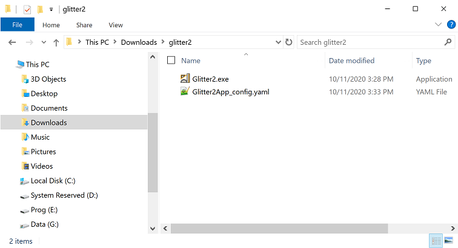
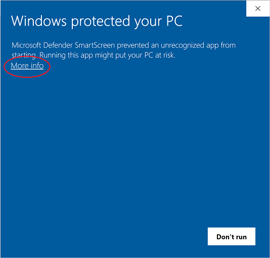
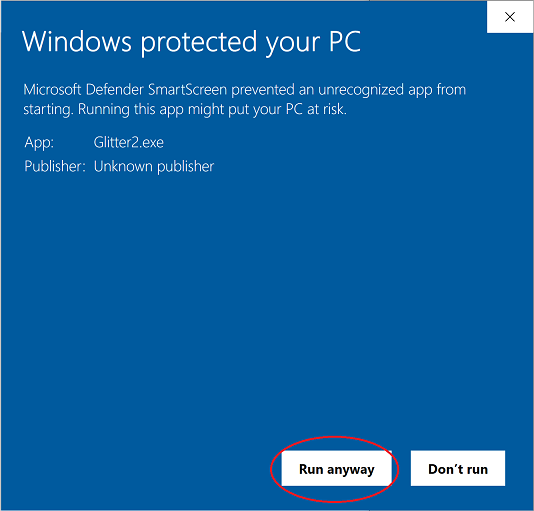
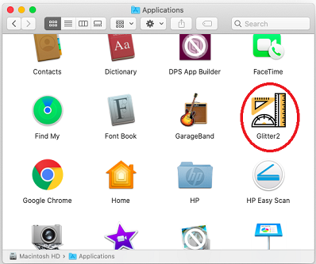
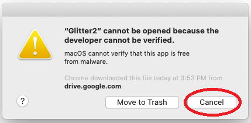
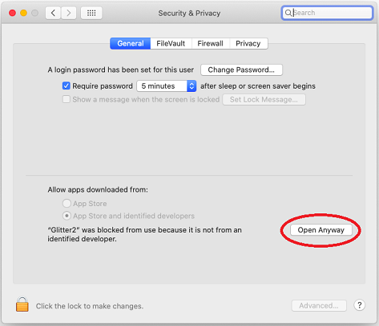
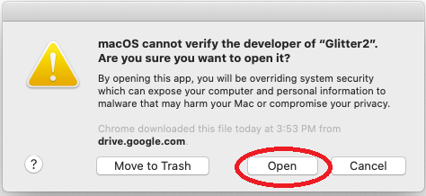
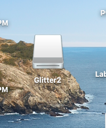

.. _install-glitter2:

Installation
============

Glitter2 can be installed either by downloading a pre-compiled application or by installing
Glitter2 and all its dependencies to a Python installation.

The latest pre-compiled app for Windows or MacOS can be downloaded from the
`release page <https://github.com/matham/glitter2/releases>`_

Installing a pre-compiled app
-----------------------------

Windows
~~~~~~~

Download ``Glitter2.exe`` and double click to run Glitter2. It will create a configuration ``.yaml``
file next to ``Glitter2.exe`` where the application settings is saved as in the following image.
The file can be safely deleted at any time.

When starting ``Glitter2.exe`` for the **first time**, Windows may refuse to run it saying the developer
is unrecognized as in the following image:

To allow it to run, click on the circled ``More info``, which will show the following image:

Click the circled ``Run anyway`` and Glitter2 will start.

MacOS
~~~~~

Download ``Glitter2.dmg`` and double click to mount and install it. This will launch the following
window. To install, drag the Glitter2 icon into the applications icon:

.. image:: images/guide/osx1.png.

To launch ``Glitter2``, in ``Finder`` browse to ``Applications`` and double clock ``Glitter2``
as in the following circled image:

The **first time**, MacOS will show the following window:

Click the circled ``cancel`` first and then on your Mac, choose the ``Apple menu`` >
``System Preferences``, and click ``Security & Privacy``, then click ``General``.
You will see the following window:

Click the lock icon to unlock it, then enter the password and the click the circled
``Open anyway``.

Then, go back to Applications again and click the ``Glitter2`` icon. This will launch
the following window, where you should click the circled ``Open``:

This will launch Glitter2. To unmount the DMG, on your desktop find the ``Glitter2`` icon
as in the following image, and right click on it and select Eject Glitter2:

Installing from source
----------------------

To install from source, first install the dependencies that need to be installed manually with::

    pip install nixio==1.5.0b4 --pre
    pip install "kivy[base]~=2.0.0" --pre

After installing the dependencies Glitter2 can be installed using::

    pip install glitter2

to get the last release from pypi, or to get glitter2 master for the most current glitter2 version do::

    pip install https://github.com/matham/glitter2/archive/master.zip
