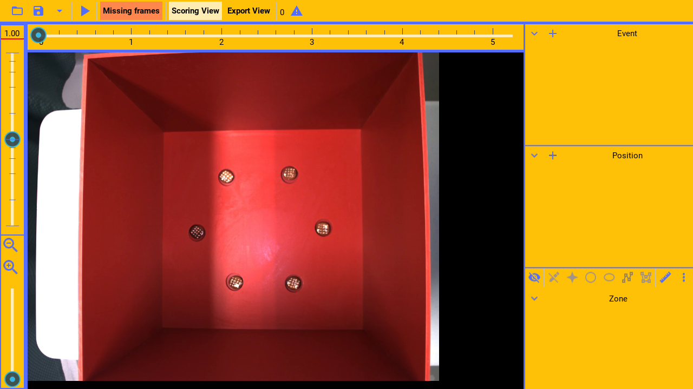
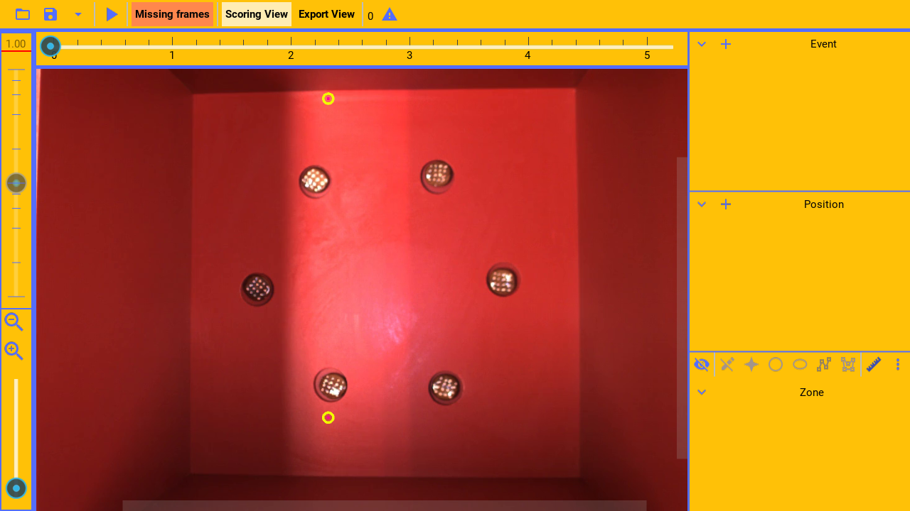
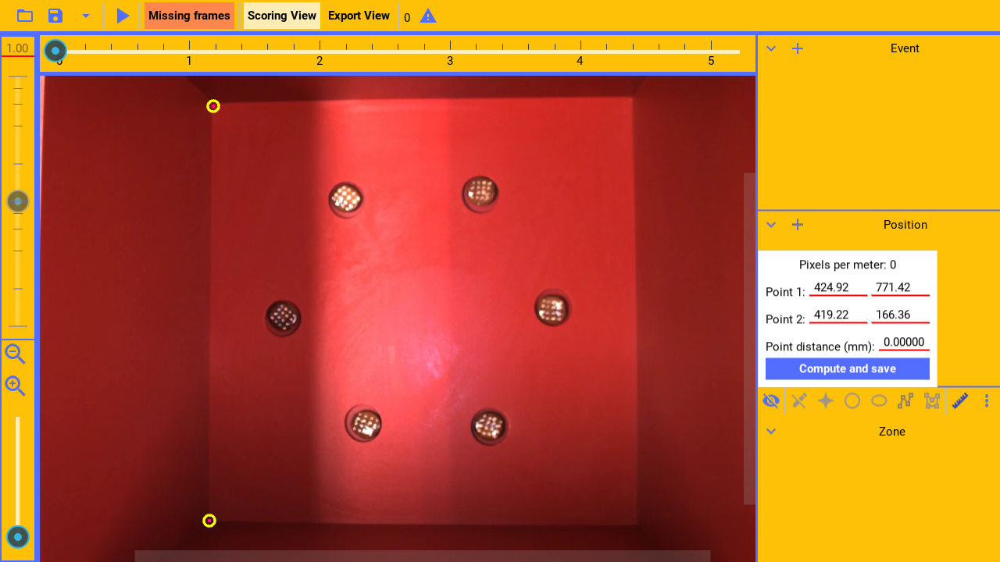

The calibration tool, allows calibrating the video size in pixels, to the real-world size
of the objects in the video.

This, for example, allows computing the real world speed from video speed. By converting
pixel measurements to meter measurements.

---

The pixels per meter metadata is exported with the raw data.

---

To show the calibration tool, press the ruler button.

(callout:
  type: rectangle
  left: 1210
  bottom: 530
  right: 1250
  top: 495)

---

This will show two points that can be adjusted to a known real world distance.

---

For example, the corners are known to be eighteen inches apart.

---

(narration-mode: fragment)

Then, press the calibration settings button,

(callout:
  type: rectangle
  left: 1250
  bottom: 530
  right: 1280
  top: 495)

---

to show the settings.

---

(narration-mode: fragment)

In the distance field,

(callout:
  type: rectangle
  left: 1120
  bottom: 450
  right: 1190
  top: 420)

---

enter the real-world distance between the points, in millimeter.

---

Finally, press the save button

(callout:
  type: rectangle
  left: 975
  bottom: 490
  right: 1195
  top: 455)

---

(narration-mode: fragment)

To compute, display, and save,

(callout:
  type: rectangle
  left: 1095
  bottom: 350
  right: 1190
  top: 325)

---

the pixels per meter for the video file.

---
