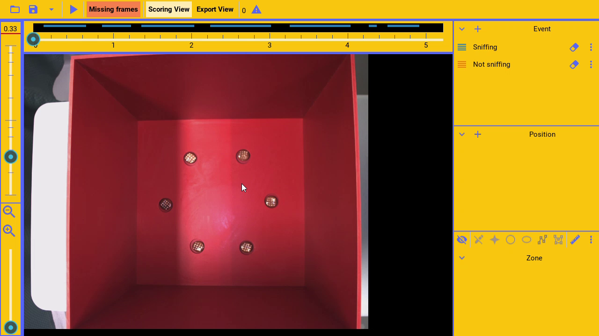

(video:
  file: coding.mp4
  sync: loop)

Event channels help code the occurrence of events, during video frames. For example, it could code when the animal is
sniffing at the left nose port, or that the animal is currently rearing.

The coded data can later be exported as raw data or summarized. For example, it can export
the total duration the animal was sniffing, or the number of rearing events.

---

```
Managing channels
```

(pause: 3)


---

(narration-mode: fragment)


To add an event channel,

---

(narration-mode: fragment)


(callout:
  type: rectangle
  left: 1000
  bottom: 80
  right: 1040
  top: 45)

click on the event plus button,

---


and a new channel will be created.

---

(narration-mode: fragment)


To configure the event channel

---

(narration-mode: fragment)


(callout:
  type: rectangle
  left: 1245
  bottom: 120
  right: 1280
  top: 80)

press the settings button,

---


this will open the configuration window.

---


To change the name, replace it with a new unique name.

(callout:
  type: rectangle
  left: 970
  bottom: 155
  right: 1080
  top: 125)

---


(pause: 1)

---


Delete the channel, by pressing the trash button.

(callout:
  type: rectangle
  left: 1225
  bottom: 160
  right: 1260
  top: 120)

---

```
Coding events
```

(pause: 3)


---

(video:
  file: coding.mp4
  sync: loop)

While the video is playing, to code that an event is currently occurring, press the channel button or
press the keyboard key configured for the channel.

---


A unique keyboard key can be assigned to each channel. For example, the letter s.

(callout:
  type: rectangle
  left: 1100
  bottom: 240
  right: 1260
  top: 210)

---


That key can then be used to code the channel, instead of 
pressing the channel button manually, with the mouse.

---


The keyboard key can be used to code in one of two modes.

(callout:
  type: rectangle
  left: 1100
  bottom: 200
  right: 1255
  top: 165)

---


In the first, the channel will be coded as active while the key is held down. In the second, pressing the key
down once, will mark all subsequent frames as active, until the key is pressed again.

---


(callout:
  type: rectangle
  left: 65
  bottom: 65
  right: 955
  top: 45)

The coded preview highlights the video frames that have been coded as active, for each channel.

---

```
Erasing event data
```

(pause: 3)


---


If a mistake was made, channel data can be erased in one of three ways.

---


(callout:
  type: rectangle
  left: 1200
  bottom: 120
  right: 1250
  top: 80)

In the first, press the erase button while playing over the frames to be cleared.

---

(video:
  file: erasing.mp4)

(pause: 2)

Notice the erase button being pressed!

---

(narration-mode: fragment)


(callout:
  type: rectangle
  left: 965
  bottom: 115
  right: 1010
  top: 80)

The second, is to select the channel

---

(video:
  file: select_delete.mp4)
(pause: 3)

and press the keyboard delete key while playing over the frames.

---

(narration-mode: fragment)


(callout:
  type: rectangle
  left: 970
  bottom: 350
  right: 1260
  top: 310)

Finally, you can clear the whole channel, by pressing the clear data button

---


and all the channel data is cleared.

---

```
Grouping channels
```

(pause: 3)



---

(narration-mode: fragment)


Sometimes, it may be desired, to exclusively code only one channel from a group of channels as active, for any frame.

To achieve this,

---


(callout:
  type: rectangle
  left: 1100
  bottom: 310
  right: 1260
  top: 280)

set the group to the same value for every channel in the group. For example, add sniff to all channels.

---

(video:
  file: group_coding.mp4)
(pause: 3)

Then, when the non-sniffing channel is coded, the sniffing channel is automatically
cleared at that timestamp.

------

```
Duplicating channel
```

(pause: 3)


---

(narration-mode: fragment)


To duplicate a channel and all its data,

---

(narration-mode: fragment)


(callout:
  type: rectangle
  left: 975
  bottom: 310
  right: 1260
  top: 275)

click on the duplicate channel button,

---


and the channel will be duplicated, identically.

---
