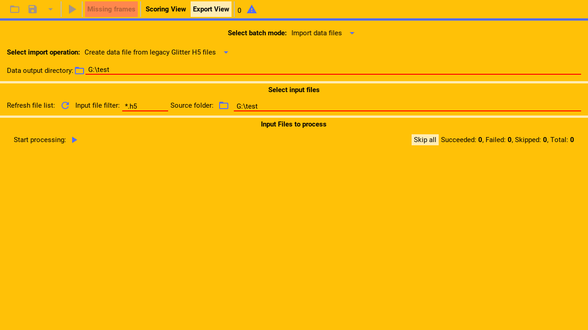
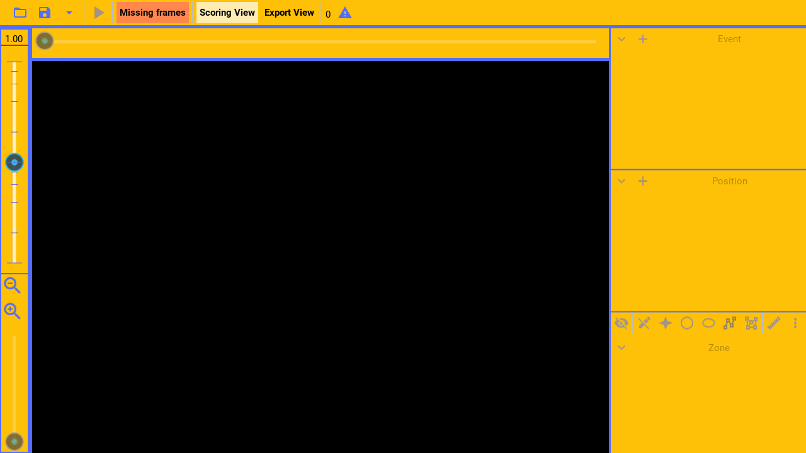
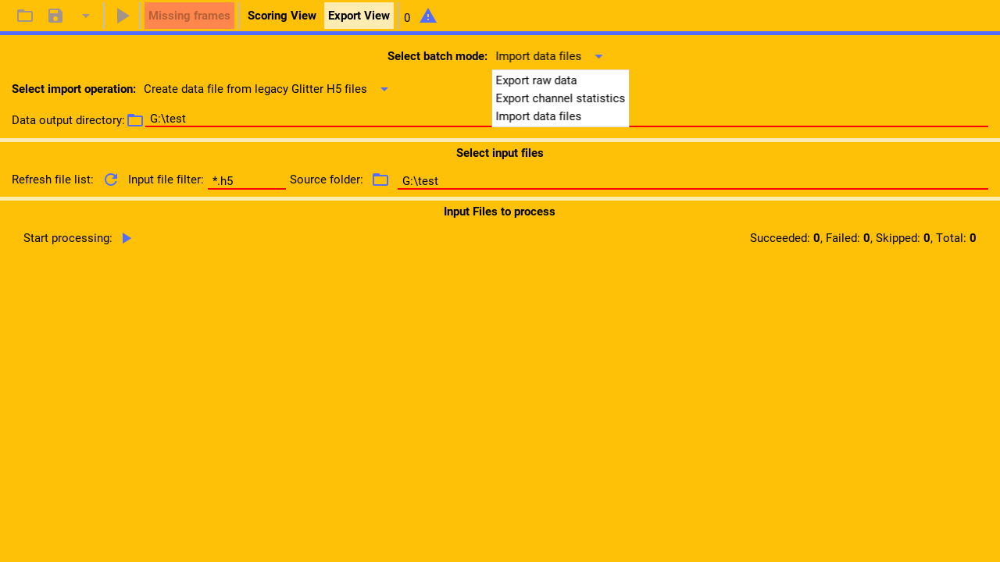
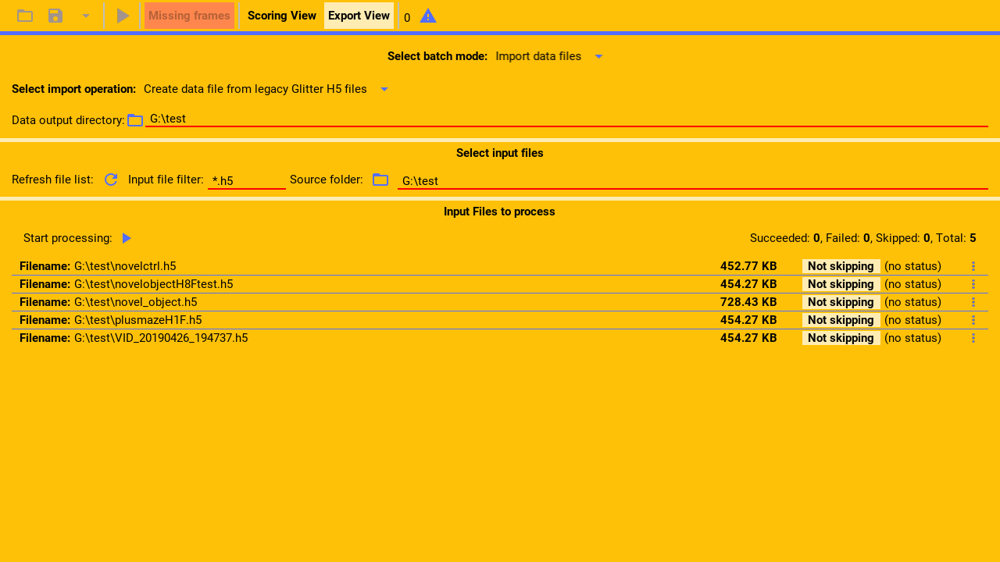
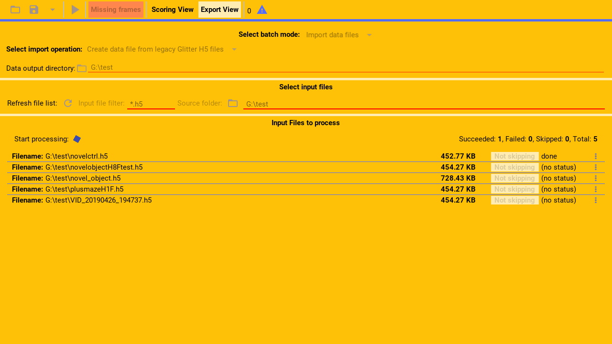
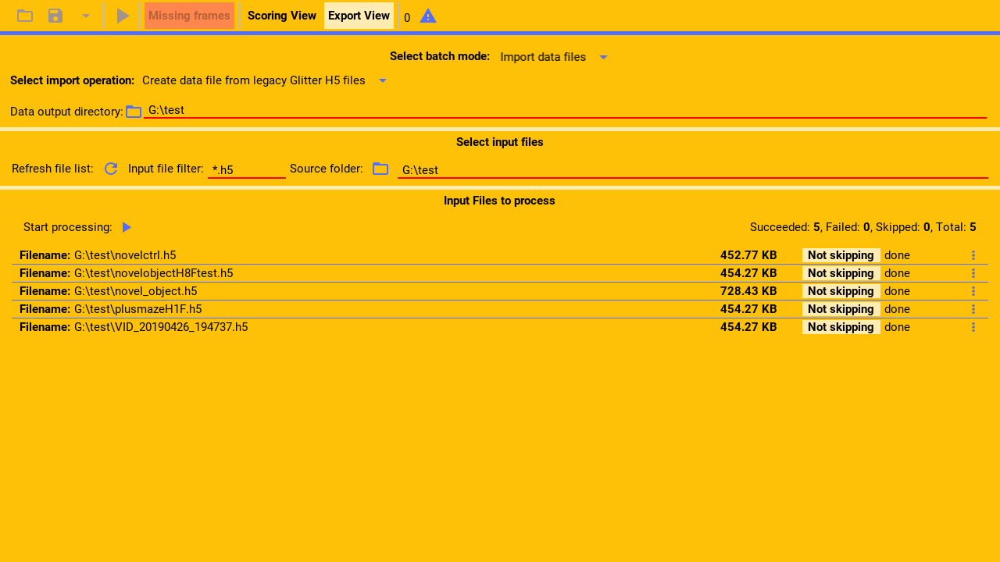

Glitter supports importing data files that have been coded externally in other programs.
For example, it can import c s v files that have been generated by another program.
Glitter imports these files and generates from them glitter h 5 data files.

---



Click export view, to switch to the export/import view from the main page.

(callout:
  type: rectangle
  left: 310
  bottom: 40
  right: 507
  top: 0)

---

(narration-mode: fragment)


Once in the export view page, you can import the external data

---



by selecting that mode from the dropdown menu.

(callout:
  type: rectangle
  left: 625
  bottom: 162
  right: 810
  top: 135)

---


Next, you will need to select and configure the type of data file to import.

(callout:
  type: rectangle
  left: 0
  bottom: 180
  right: 1280
  top: 90)

---


See the other videos for instructions for each supported import file type.

---

```
Processing
```

(pause: 2)



---


Once the appropriate input files have been selected, for example the legacy glitter files,
press the play button to start importing the files.

(callout:
  type: rectangle
  left: 145
  bottom: 325
  right: 185
  top: 285)

---

(narration-mode: fragment)



It will import the files one by one,

(pause: 1)

---



until all the files are imported and created in the configured target directory.

---
