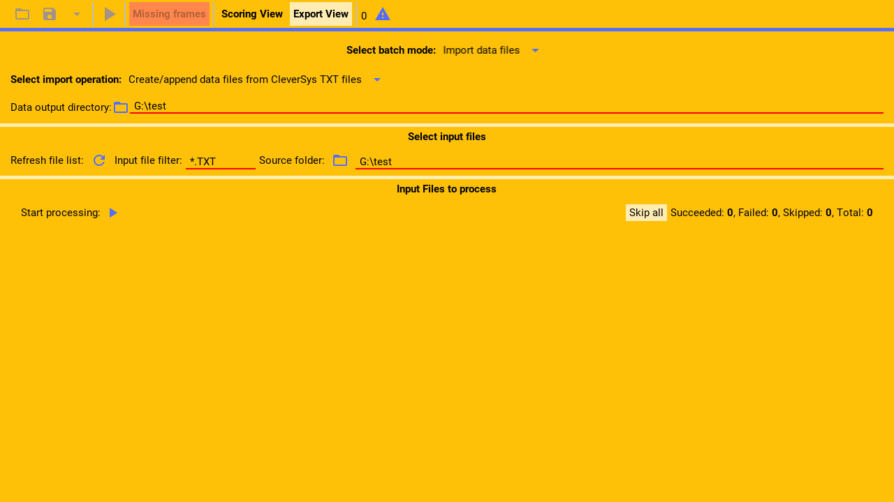
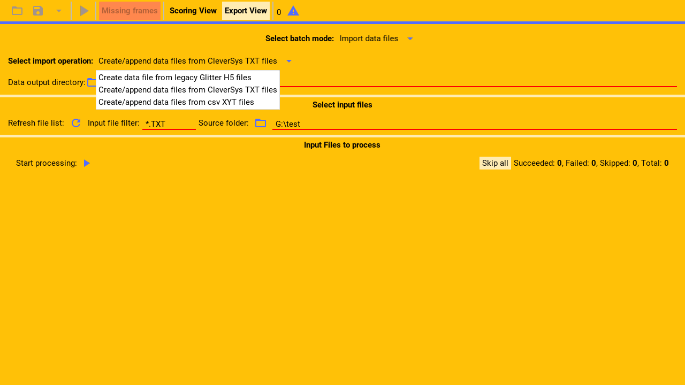
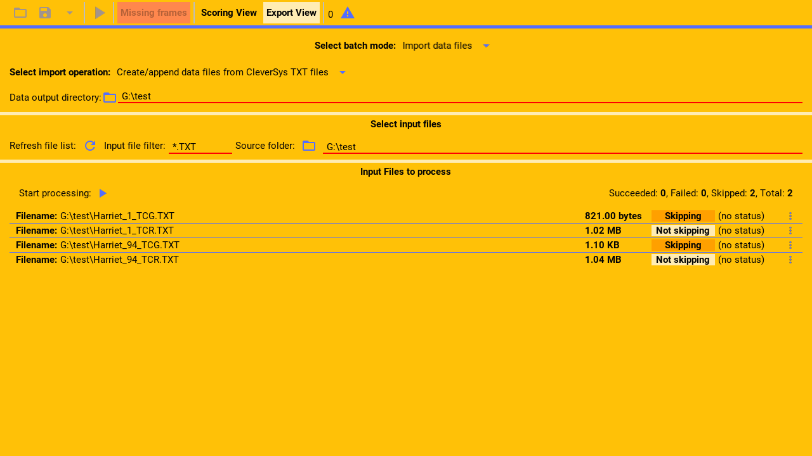

Glitter supports importing t x t files that contain coded data exported by the Clever System program.

Demo t x t files can be found in the source code.

---

From within the import section.

First, select the Clever System importing mode from the drop down menu.

(callout:
  type: rectangle
  left: 178
  bottom: 178
  right: 522
  top: 155)

---

Next, select the output directory, where the glitter h 5 data files that are generated
from the t x t files, will be created.

(callout:
  type: rectangle
  left: 6
  bottom: 172
  right: 500
  top: 130)

---

Then, select the input directory containing the t x t files to process.

(callout:
  type: rectangle
  left: 368
  bottom: 250
  right: 685
  top: 213)

---

This directory must also contain the video files used to generate the t x t files, because
the video files are needed by glitter to generate the h 5 files.

---

Next, select the filter with which to select the t x t files in that directory and sub-directories.

The shown filter will only select files that end with the t x t extension.

(callout:
  type: rectangle
  left: 155
  bottom: 250
  right: 368
  top: 213)

---

Finally, click refresh.

(callout:
  type: rectangle
  left: 126
  bottom: 250
  right: 157
  top: 213)

---

Glitter will now list all the matched files and they are ready to be processed as described in the
main import guide.

Only the t c r files should be selected, because they contain the data. However, the t c g files
should also be in that directory, if they exist, because they will then be used to import the zones.

---
