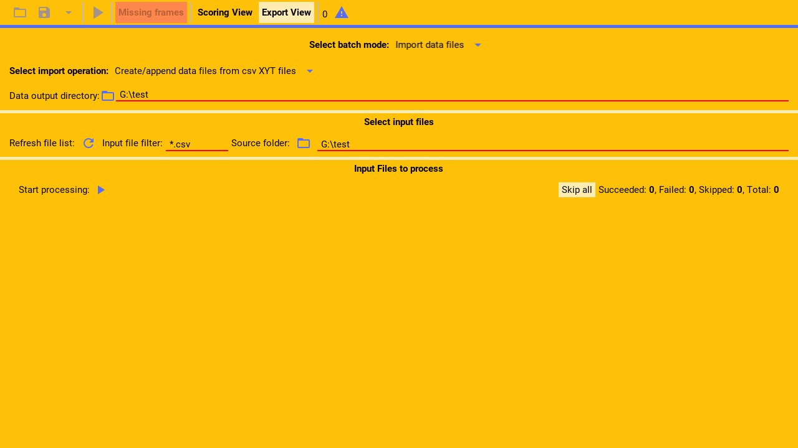
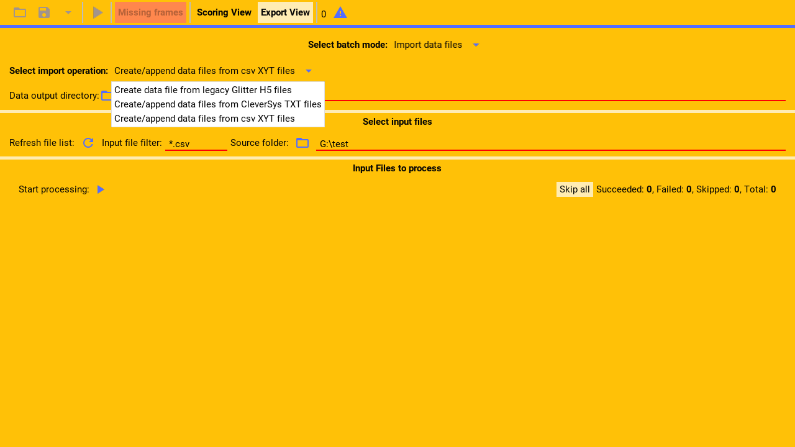
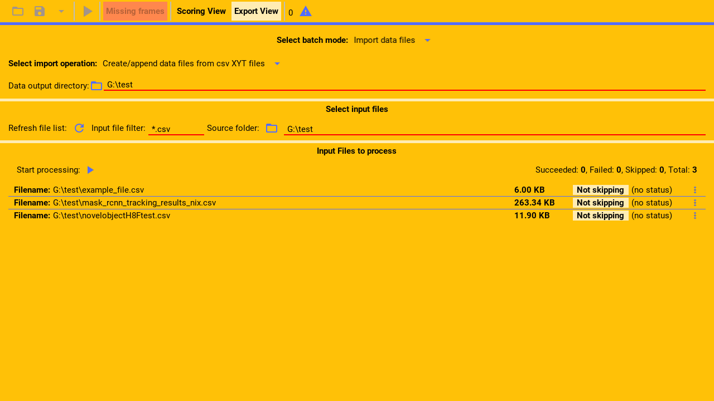

Glitter supports importing c s v files that contain coded data exported by other programs.

Demo c s v files can be found in the source code.

---

From within the import section.

First, select the c s v importing mode from the drop down menu.

(callout:
  type: rectangle
  left: 178
  bottom: 203
  right: 522
  top: 178)

---

Then, select the output directory, where the glitter h 5 data files that are generated
from the c s v files, will be created.

(callout:
  type: rectangle
  left: 6
  bottom: 172
  right: 500
  top: 130)

---

Next, select the input directory containing the c s v files to process.

(callout:
  type: rectangle
  left: 368
  bottom: 250
  right: 685
  top: 213)

---

This directory should optionally contain the video files that was used to generate the c s v files.
Glitter needs these video files if the input c s v files do not contain data for all video frames.

---

Then, select a filter with which to select the c s v files in that directory and sub-directories.

The shown filter will only select files that end with the c s v extension.

(callout:
  type: rectangle
  left: 155
  bottom: 250
  right: 368
  top: 213)

---

Finally, click refresh.

(callout:
  type: rectangle
  left: 126
  bottom: 250
  right: 157
  top: 213)

---

Glitter will now list all the matched files and they are ready to be processed as described in the
main import guide.

---
