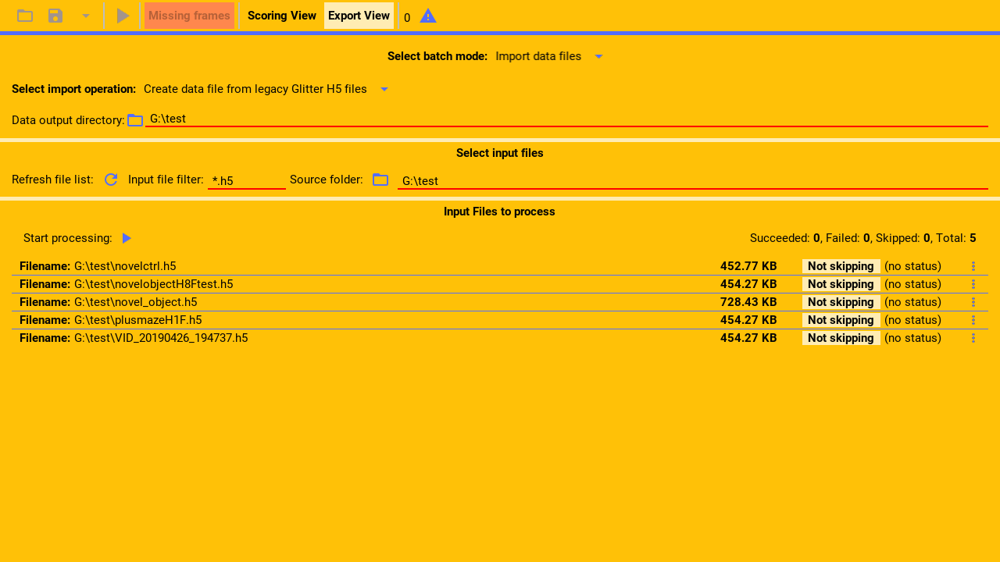

Glitter supports importing legacy glitter files. These are files created by much
older versions of glitter that cannot be opened directly by the current version of glitter.

---

From within the import section.

First, select the legacy importing mode from the drop down menu.

(callout:
  type: rectangle
  left: 178
  bottom: 155
  right: 522
  top: 131)

---

Then, select the output directory, where the glitter h 5 data files that are generated
from the legacy files, will be created.

(callout:
  type: rectangle
  left: 6
  bottom: 172
  right: 500
  top: 130)

---

Next, select the input directory containing the legacy files to process.

(callout:
  type: rectangle
  left: 368
  bottom: 250
  right: 685
  top: 213)

---

then, select the filter with which to select the legacy files in that directory and sub-directories.

The shown filter will only select files that end with the h 5 extension.

(callout:
  type: rectangle
  left: 155
  bottom: 250
  right: 368
  top: 213)

---

Finally, click refresh.

(callout:
  type: rectangle
  left: 126
  bottom: 250
  right: 157
  top: 213)

---

Glitter will now list all the matched files and they are ready to be processed as described in the
main import guide.

---
