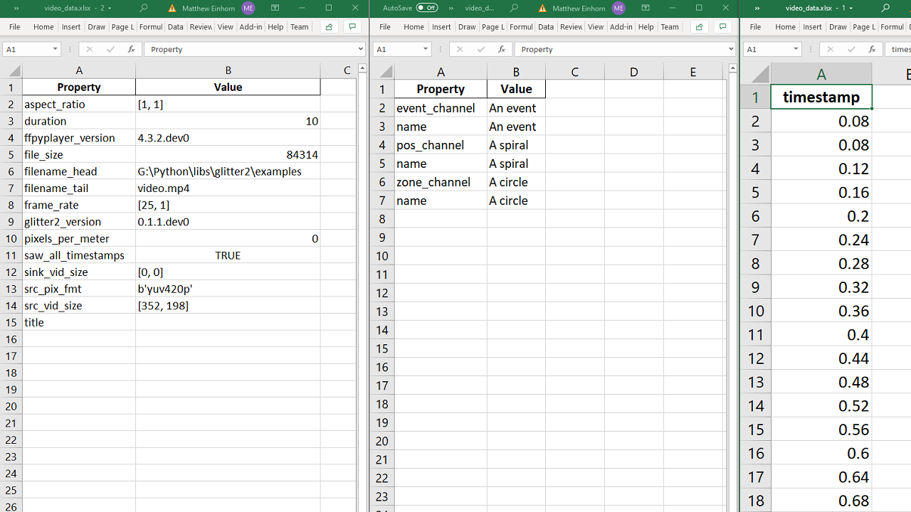
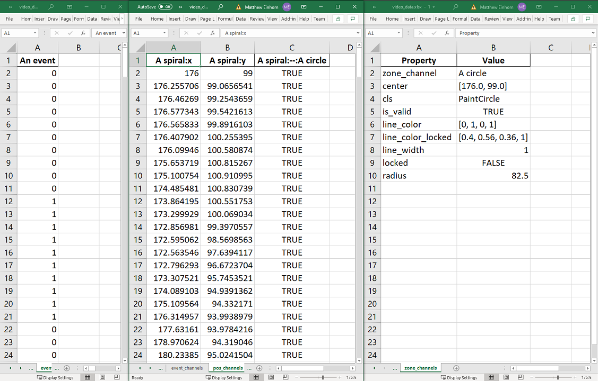

Glitter supports batch exporting of the raw data that has been coded with glitter, into excel files that
can then be used with other programs.

---



The exported data includes the video and channels metadata.

(pause: 3)

---



And the exported data also includes the raw coded data from the event, position, and zone channels.

(pause: 3)

---


Click export view, to switch to the export view from the main page.

(callout:
  type: rectangle
  left: 310
  bottom: 40
  right: 507
  top: 0)

---

(narration-mode: fragment)


Once in the export view page, you can export the raw data

---


by selecting that mode from the dropdown menu.

(callout:
  type: rectangle
  left: 625
  bottom: 115
  right: 810
  top: 85)

---

```
Exporting
```

(pause: 2)


---


To export the data, first select the folder into which the excel files will be saved,
as well as any configuration options.

(callout:
  type: rectangle
  left: 0
  bottom: 155
  right: 835
  top: 85)

---


Next, select the input data files to export.

(callout:
  type: rectangle
  left: 0
  bottom: 235
  right: 1280
  top: 170)

---


First, select the directory to process.

(callout:
  type: rectangle
  left: 368
  bottom: 235
  right: 685
  top: 200)

---


Then, select a filter with which to select the data files in that directory and sub-directories.

The shown filter will only select files that end with the h 5 extension, which is the extension of the data files.

(callout:
  type: rectangle
  left: 155
  bottom: 235
  right: 368
  top: 200)

---


Finally, click refresh.

(callout:
  type: rectangle
  left: 126
  bottom: 235
  right: 157
  top: 200)

---


Glitter will now list all the matched files that are to be processed.

---


To start the export process, press the play button to start exporting the files.

(callout:
  type: rectangle
  left: 145
  bottom: 308
  right: 185
  top: 275)

---

(narration-mode: fragment)


It will export the files one by one,

(pause: 1)

---


until all the files are exported.

---


The exported excel files can then be found in the configured directory.

---
