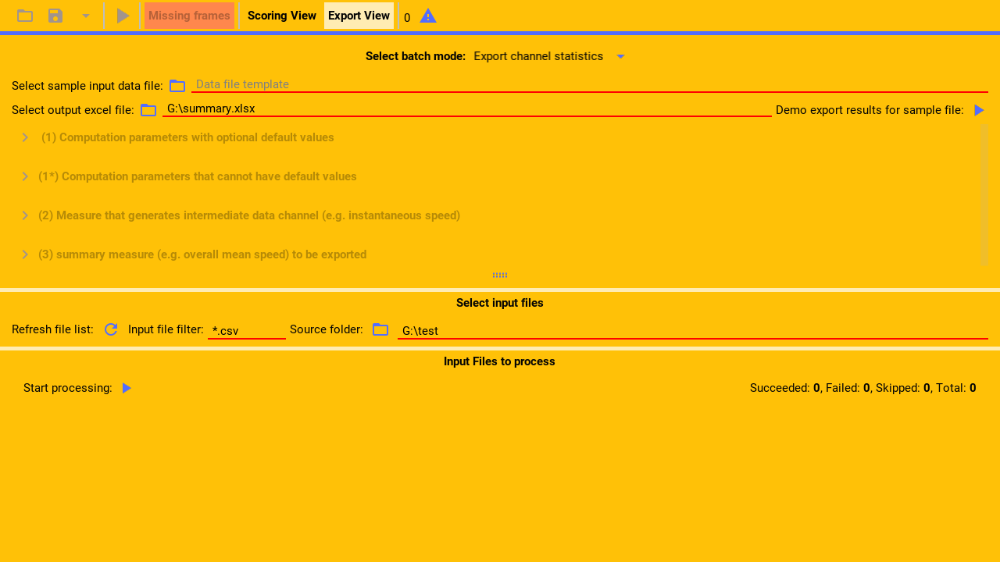

Glitter supports computing statistics from the glitter coded data. It can compute
for example, the number of events of an event channel or the mean speed of a
position channel. The summery data can then be batch exported to an excel file. 

---

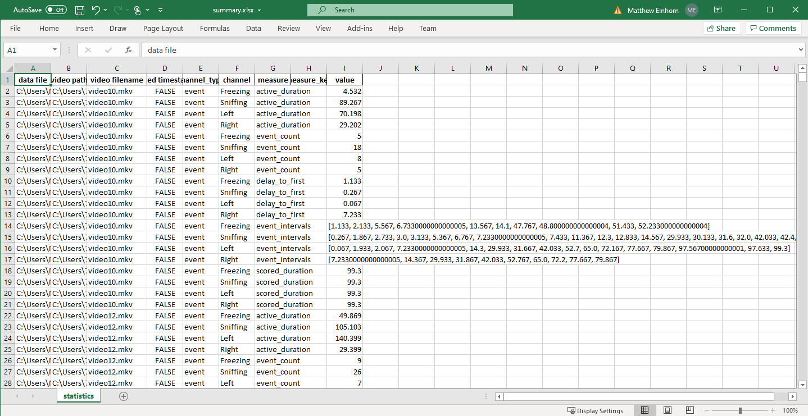

Here's an example summary excel file.

(pause: 3)

---

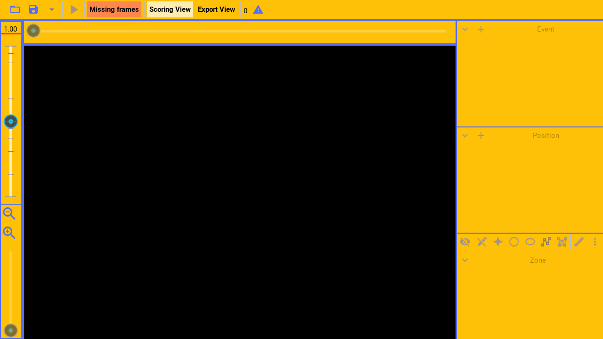

From the main page, click export view, to switch to the export page.

(callout:
  type: rectangle
  left: 310
  bottom: 40
  right: 507
  top: 0)

---

(narration-mode: fragment)


Once in the export view page, you can generate the summaries

---

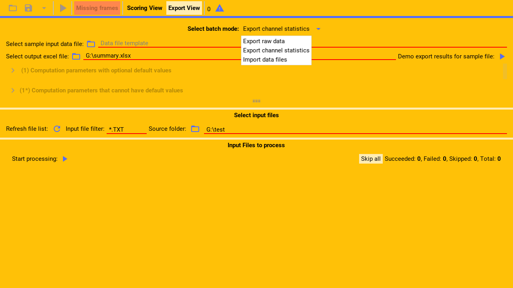

by selecting that mode from the dropdown menu.

(callout:
  type: rectangle
  left: 600
  bottom: 137
  right: 777
  top: 113)

---


Following are the overall steps to export the data, with some of them optional.

(pause: 3)

```
1. Select template and output file.
2. Set parameters (optional) and docs.
3. Create intermediate data channels (optional).
4. Add summary measures.
5. Select and batch process input files.
```

---

```
1. Select template and output file
2.
```

(pause: 2)


---


All files in the batch to be processed, must contain similar data channels. Otherwise,
they must be exported in separate batches.

---


Any one file from the batch, must initially be selected as a template. This template file
will be used to create summary measures using the channel names in the file and then applied
to all the files in the batch.

Select this file here.

(callout:
  type: rectangle
  left: 210
  bottom: 125
  right: 525
  top: 95)

---

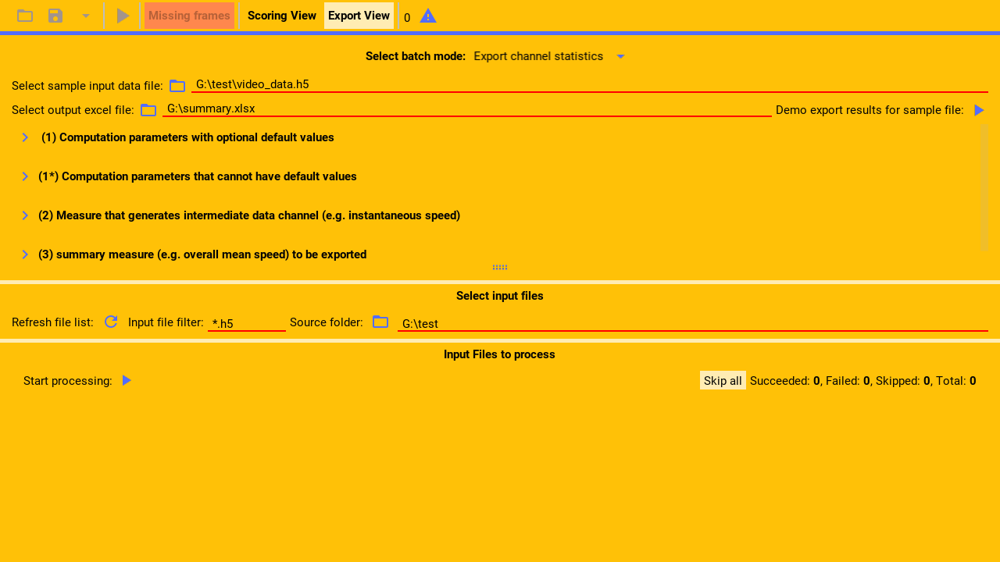

(pause: 1)

---


Also select the excel file where all the data will be exported to.

(callout:
  type: rectangle
  left: 173
  bottom: 160
  right: 520
  top: 125)

---

```
1. Select template and output file
2. Set parameters (optional) and docs.
```

(pause: 2)


---


Many measures accept parameters, such as a threshold or a start time.

Some of these parameters can be given global default values shared across all measures
that use them.

(callout:
  type: rectangle
  left: 15
  bottom: 200
  right: 440
  top: 160)

---

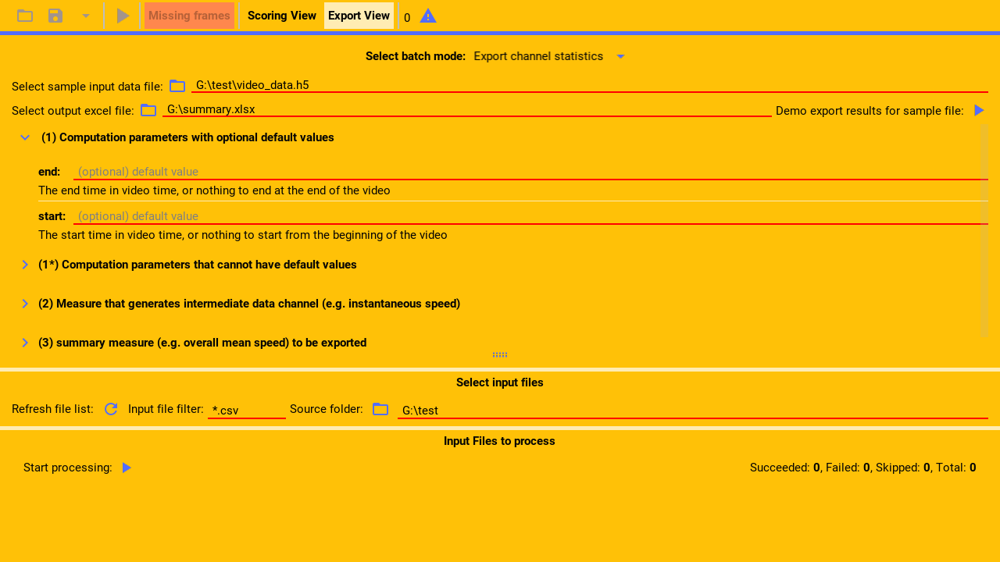

This section lists all these optional parameters as well as an explanation for each parameter.

(callout:
  type: rectangle
  left: 45
  bottom: 260
  right: 700
  top: 200)

---

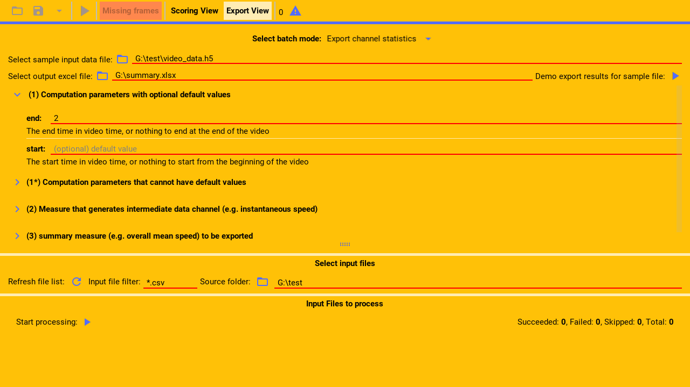

For example, the end parameter can be set to 2. Then, only the first two seconds of the
video will be used in the data summaries.

(callout:
  type: rectangle
  left: 45
  bottom: 260
  right: 700
  top: 200)

---


Other parameters are specific to individual measures and cannot be given global default values.

(callout:
  type: rectangle
  left: 15
  bottom: 250
  right: 500
  top: 200)

---

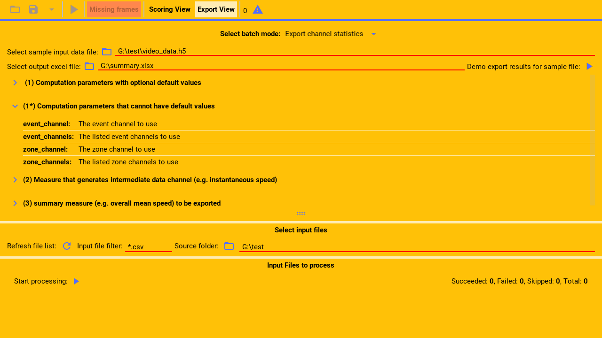

This section lists all these parameters and an explanation for them.

(callout:
  type: rectangle
  left: 30
  bottom: 360
  right: 500
  top: 250)

---

```
1. Select template and output file.
2. Set parameters (optional) and docs.
3. Create intermediate data channels (optional).
```

(pause: 2)


---


Some measures require intermediate data channels, in addition to the user-coded channels.

For example, to compute the total time the animal's nose was in a zone. We can create an intermediate
event channel from the nose position channel and the zone channel. This channel would be active whenever
the nose is in the zone.

Then, for example, we can compute with the intermediate channel, the number of
times the nose entered the zone.

(callout:
  type: rectangle
  left: 15
  bottom: 300
  right: 620
  top: 250)

---

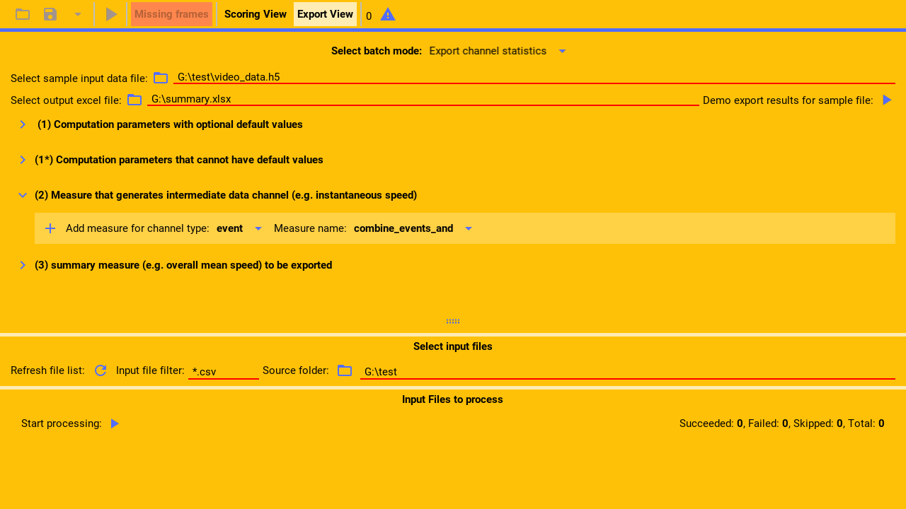

This section lets you create these intermediate channels.

(callout:
  type: rectangle
  left: 40
  bottom: 355
  right: 777
  top: 280)

---

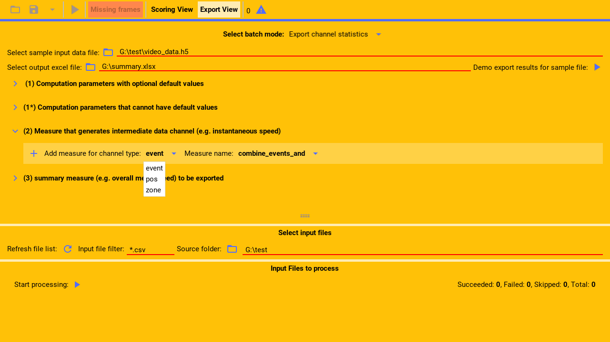

To add a measure channel. First select the type of channel from which it will be created.
For example, a position channel.

(callout:
  type: rectangle
  left: 290
  bottom: 420
  right: 375
  top: 300)

---

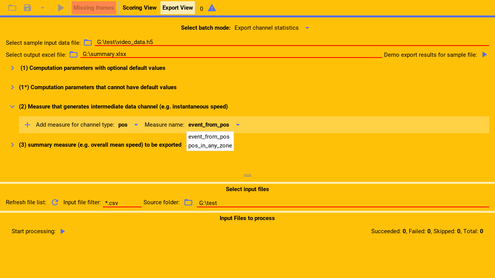

Then select the measure to create

(callout:
  type: rectangle
  left: 475
  bottom: 400
  right: 640
  top: 300)

---


For example, the position channel is in a zone measure, mentioned above.

(callout:
  type: rectangle
  left: 480
  bottom: 345
  right: 640
  top: 300)

---


And click the plus button to create it.

(callout:
  type: rectangle
  left: 50
  bottom: 345
  right: 88
  top: 300)

---


Now, we will need to configure the channel.

(callout:
  type: rectangle
  left: 45
  bottom: 390
  right: 1280
  top: 350)

---

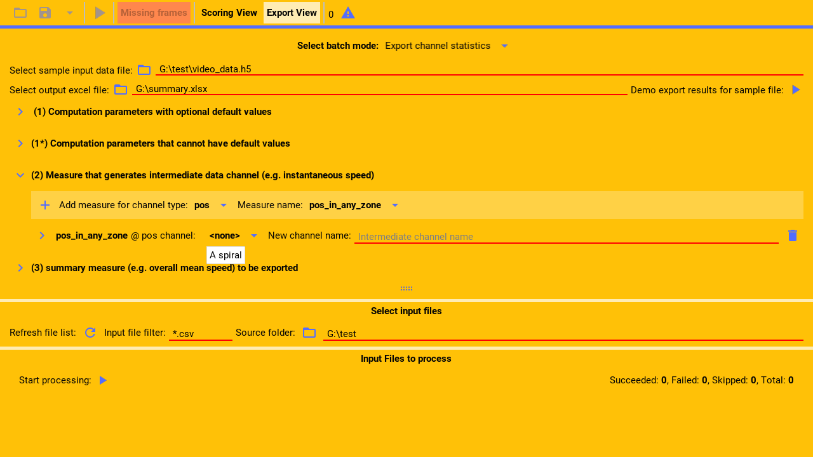

From the populated list of position channel names in the template file.

(callout:
  type: rectangle
  left: 315
  bottom: 422
  right: 415
  top: 350)

---

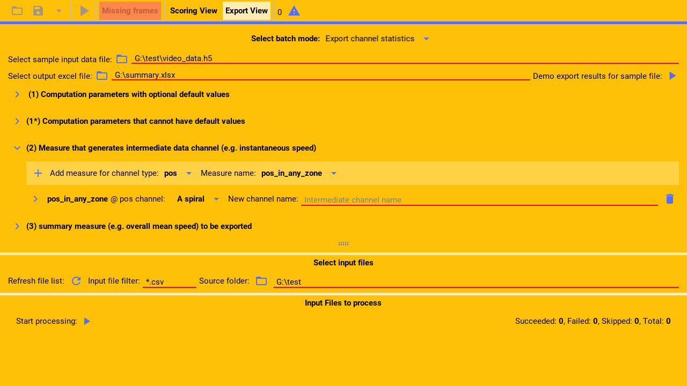

Select a channel. For example the spiral channel.

(callout:
  type: rectangle
  left: 320
  bottom: 385
  right: 415
  top: 355)

---

(narration-mode: fragment)


Then, expand the channel options,

(callout:
  type: rectangle
  left: 50
  bottom: 385
  right: 80
  top: 355)

---

(narration-mode: fragment)

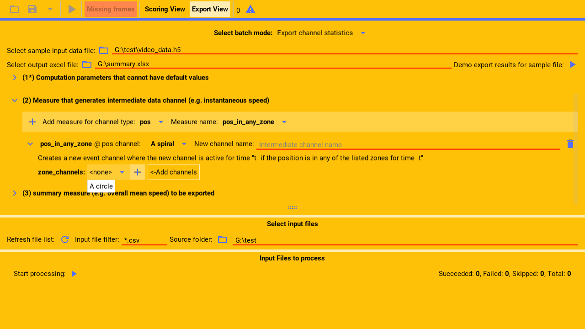

to show the documentation for the channel,

(pause: 1)

(callout:
  type: rectangle
  left: 75
  bottom: 355
  right: 950
  top: 330)

---


as well as to configure any channel parameters.

(callout:
  type: rectangle
  left: 65
  bottom: 425
  right: 470
  top: 355)

---

(narration-mode: fragment)


For example, from the list of zone channels

(callout:
  type: rectangle
  left: 180
  bottom: 425
  right: 320
  top: 350)

---

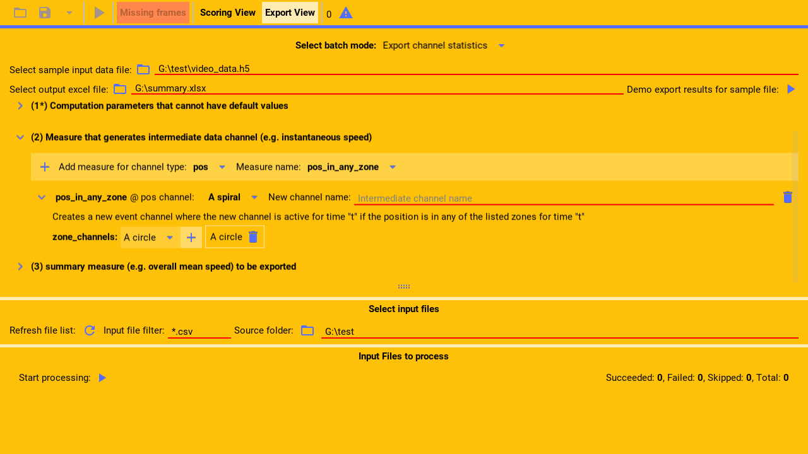

select and add the circle channel.

(callout:
  type: rectangle
  left: 322
  bottom: 400
  right: 425
  top: 350)

---


The intermediate channel will now create an event channel that is active,
whenever the spiral channel is within the circle zone.

---

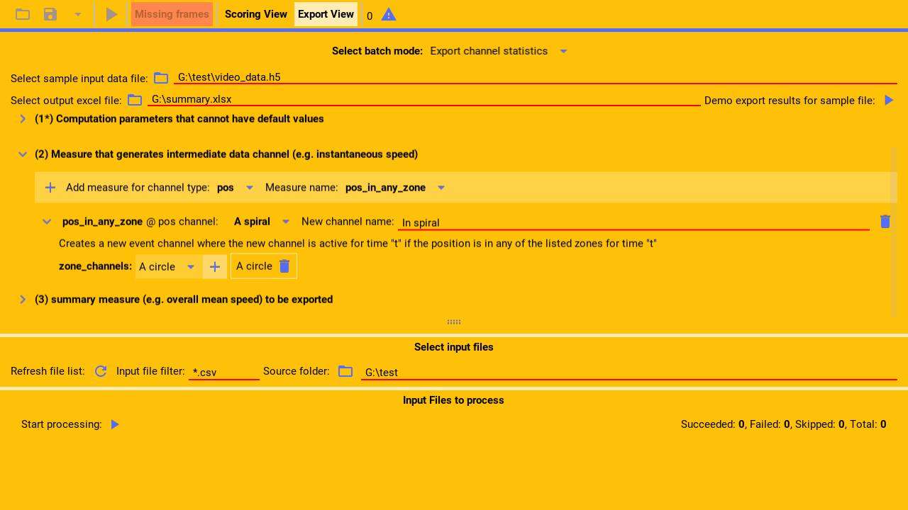

Finally, give the new intermediate channel a unique name.

(callout:
  type: rectangle
  left: 555
  bottom: 330
  right: 700
  top: 295)

---

```
1. Select template and output file.
2. Set parameters (optional) and docs.
3. Create intermediate data channels (optional).
4. Add summary measures.
```

(pause: 2)


---


Glitter supports computing and exporting many common summary measures for all channel types.

For example, we can export the mean speed of a position channel, the number of active periods
and total active duration of an event channel, or the total area of a zone channel.

(callout:
  type: rectangle
  left: 15
  bottom: 355
  right: 500
  top: 300)

---

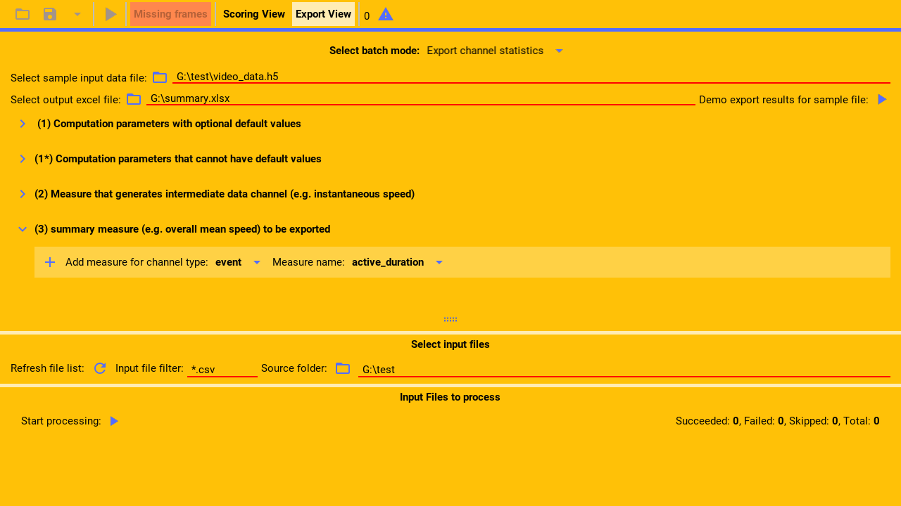

This section lets you create these summary measures.

(callout:
  type: rectangle
  left: 40
  bottom: 400
  right: 680
  top: 345)

---

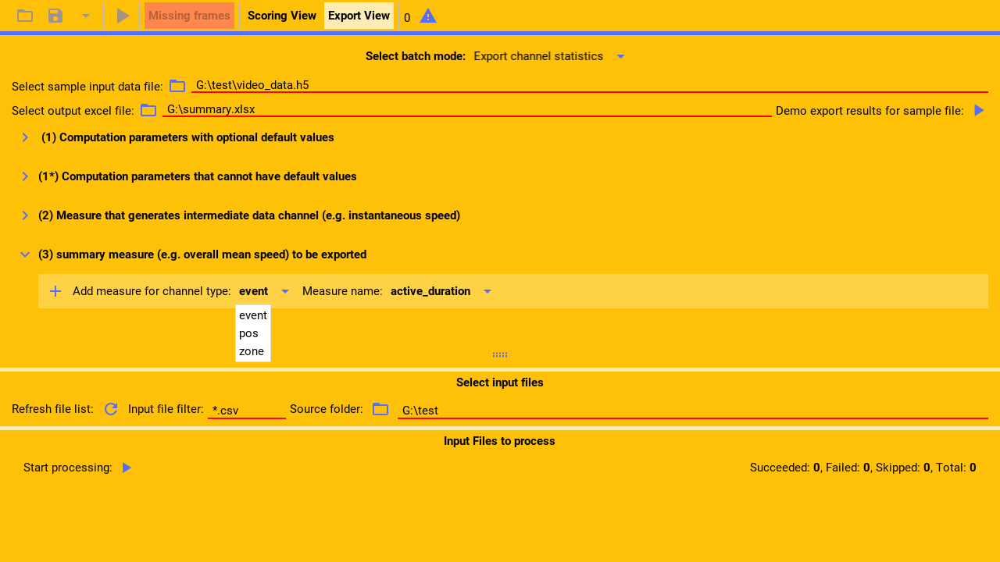

To add a measure. Select the type of channel to which it will be applied and the specific measure.

(callout:
  type: rectangle
  left: 295
  bottom: 467
  right: 645
  top: 350)

---


And click the plus button to create it.

(callout:
  type: rectangle
  left: 50
  bottom: 390
  right: 88
  top: 352)

---

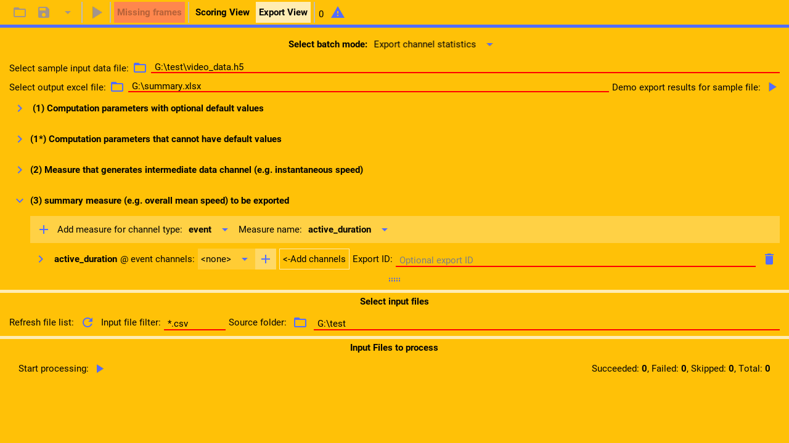

This measure will compute the total duration that the specified event channel was coded as active.

(callout:
  type: rectangle
  left: 45
  bottom: 440
  right: 1280
  top: 400)

---

(narration-mode: fragment)

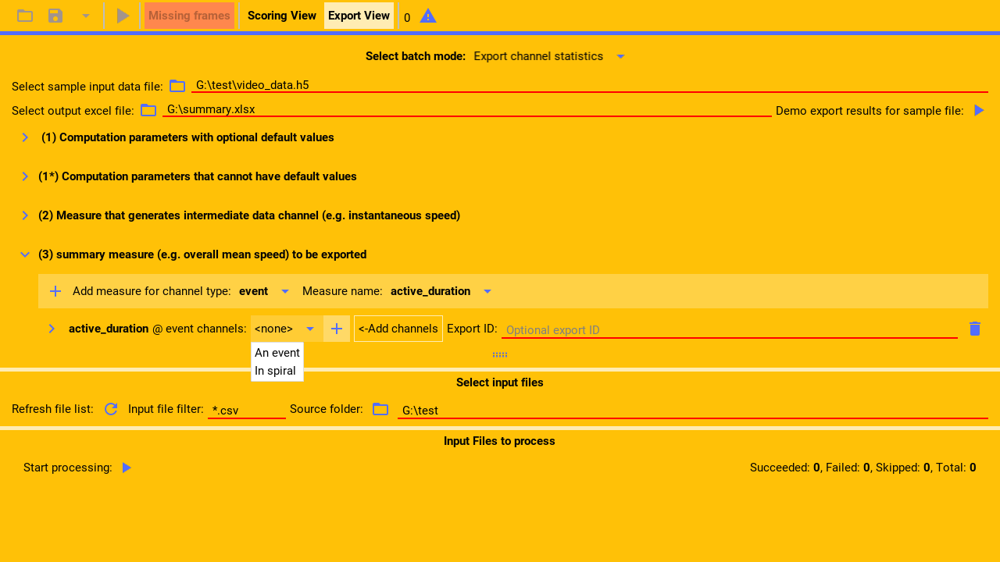

Next, we need to select the channels for which we will compute this in the report.

(callout:
  type: rectangle
  left: 315
  bottom: 495
  right: 450
  top: 400)

---

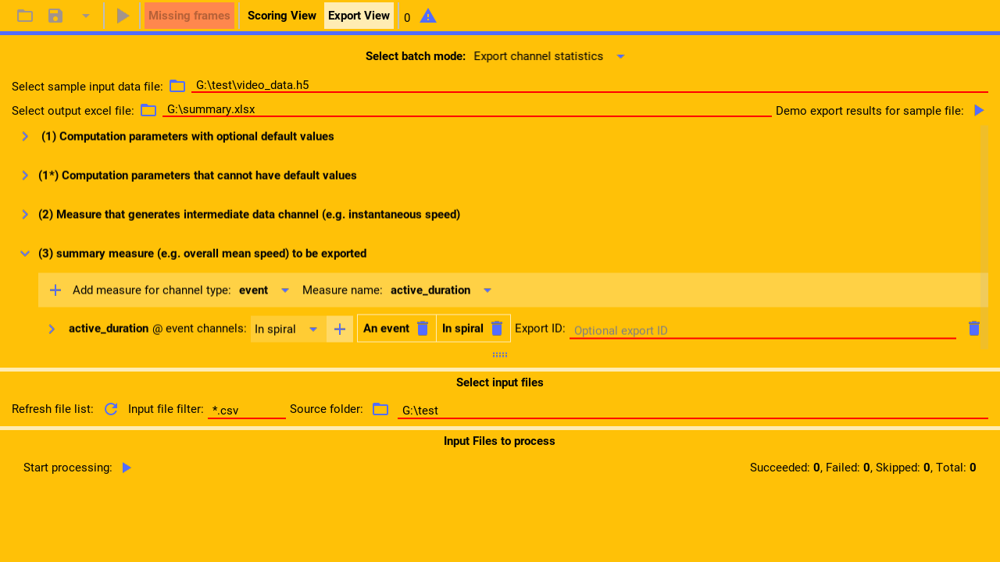

It will be computed for both the spiral and event channels.

(callout:
  type: rectangle
  left: 454
  bottom: 443
  right: 657
  top: 398)

---


You can also optionally add an ID to the measure that will be included with the measure in the report.

(callout:
  type: rectangle
  left: 656
  bottom: 441
  right: 902
  top: 403)

---

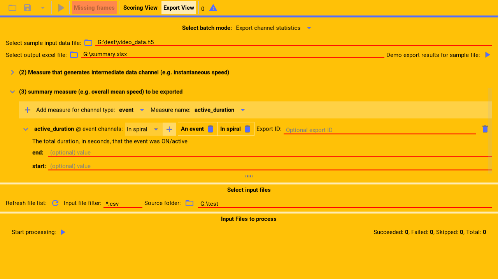

Finally, you can further configure the measure or read the measure documentation.

(pause: 2)

(callout:
  type: rectangle
  left: 68
  bottom: 463
  right: 560
  top: 353)

---

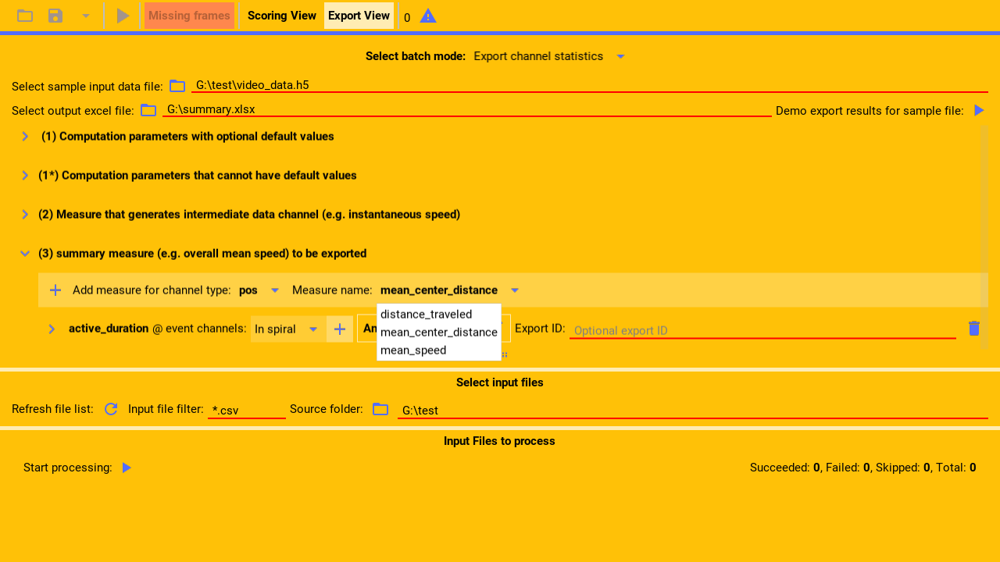

Next, we will select and add another measure.

(callout:
  type: rectangle
  left: 300
  bottom: 466
  right: 672
  top: 351)

---

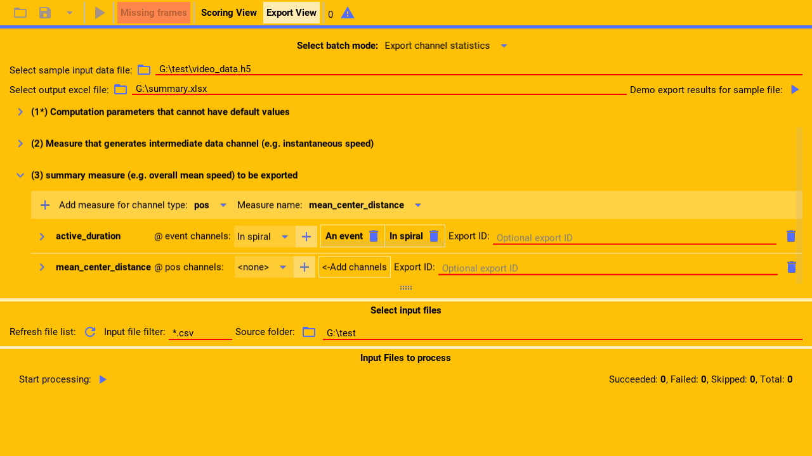

This measure computes the mean distance between a position channel and the center of a zone.

(callout:
  type: rectangle
  left: 45
  bottom: 447
  right: 1265
  top: 402)

---

(narration-mode: fragment)

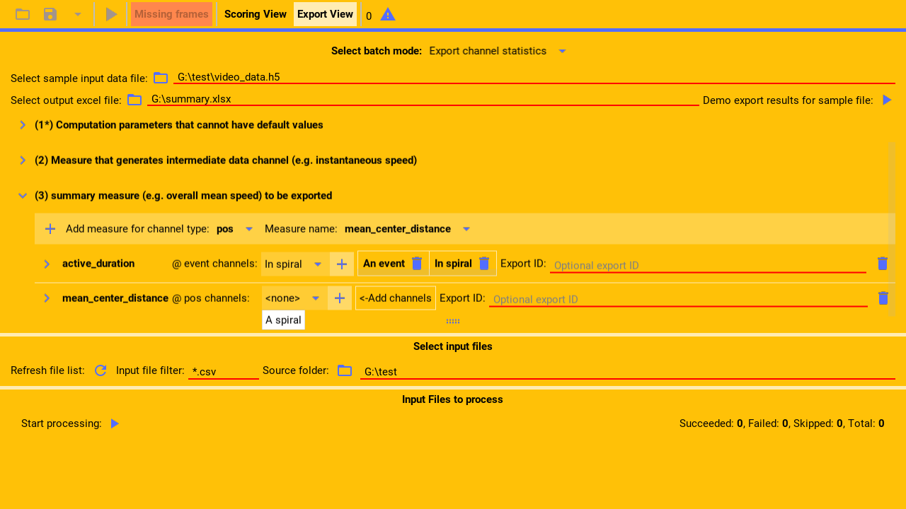

From the pre-populated position channel list,

(callout:
  type: rectangle
  left: 366
  bottom: 470
  right: 499
  top: 402)

---

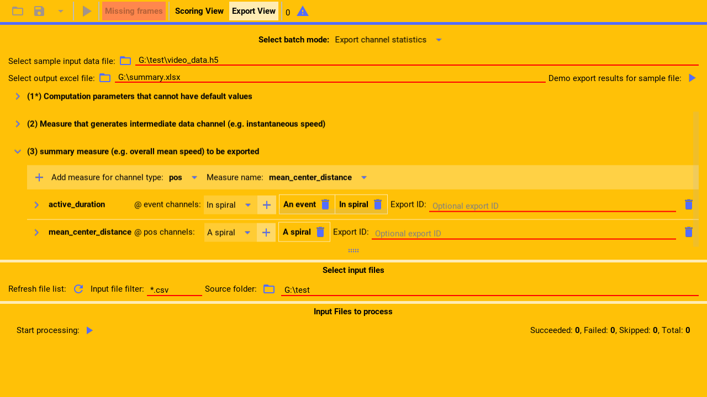

we will compute this measure for the spiral channel.

(callout:
  type: rectangle
  left: 501
  bottom: 441
  right: 601
  top: 400)

---

(narration-mode: fragment)

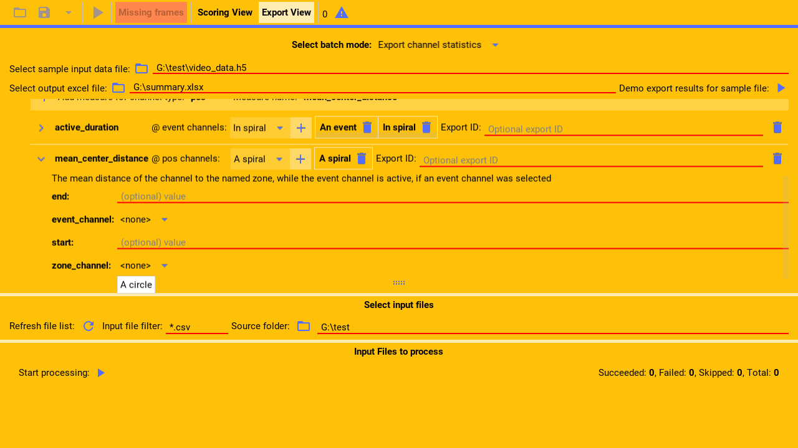

For the zone channel parameter, from the data file's list of zones,

(callout:
  type: rectangle
  left: 75
  bottom: 473
  right: 280
  top: 415)

---

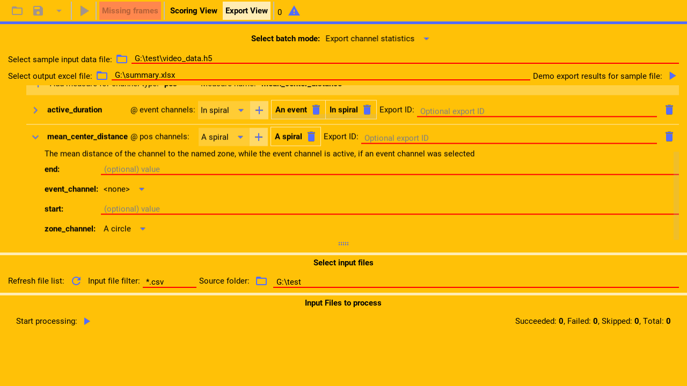

we will select the circle zone.

Therefore, this measure will compute the mean distance between the
spiral channel and the center of the circle.

(callout:
  type: rectangle
  left: 76
  bottom: 438
  right: 284
  top: 411)

---


You can further read the measure documentation, or set the optional parameters.

(pause: 2)

(callout:
  type: rectangle
  left: 71
  bottom: 447
  right: 915
  top: 275)

---

```
1. Select template and output file.
2. Set parameters (optional) and docs.
3. Create intermediate data channels (optional).
4. Add summary measures.
5. Select and batch process input files.
```

(pause: 2)


---


Once we configured the measures, we can select the files in the batch.

First, select the input directory with the data files to process.

(callout:
  type: rectangle
  left: 470
  bottom: 430
  right: 840
  top: 390)

---


Then, select a filter with which to select the data files in that directory and sub-directories.

The shown filter will only select files that end with the h 5 extension, which is the extension of the data files.

(callout:
  type: rectangle
  left: 262
  bottom: 430
  right: 369
  top: 390)

---


Finally, click refresh.

(callout:
  type: rectangle
  left: 123
  bottom: 430
  right: 159
  top: 390)

---

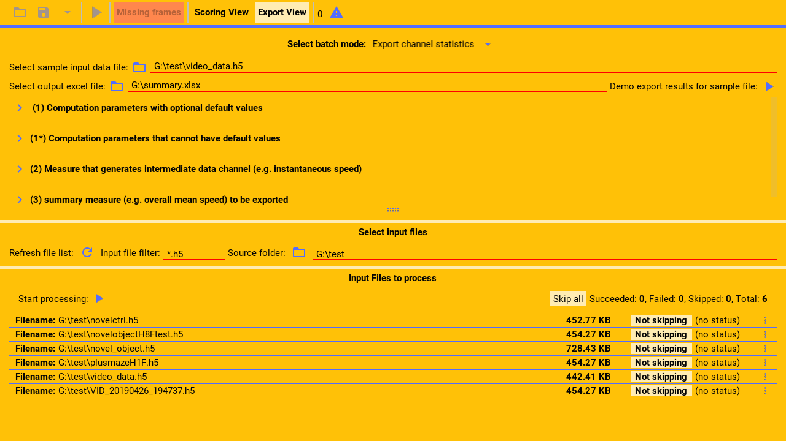

Glitter will now list all the matched files that are to be processed.

---


To start the export process, press the play button to start exporting data from the files.

(callout:
  type: rectangle
  left: 145
  bottom: 500
  right: 180
  top: 470)

---


Then, the exported data will be found in the configured excel file.

(pause: 2)

---
