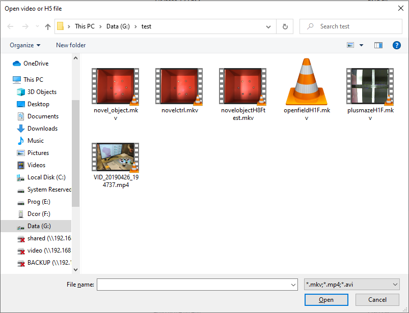
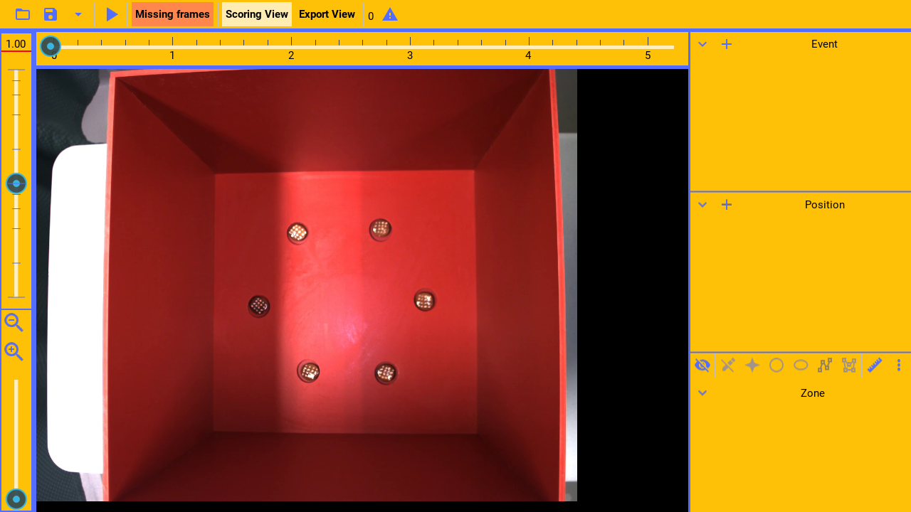
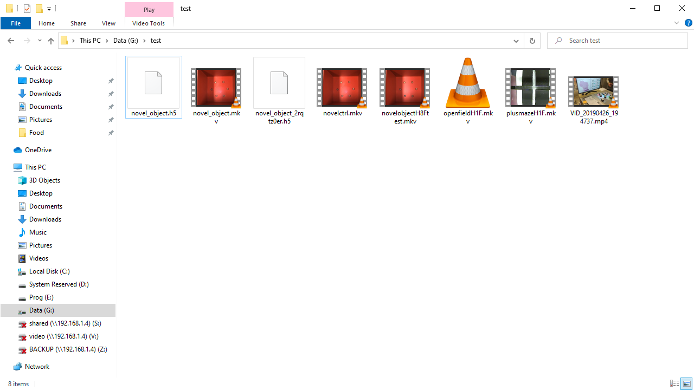
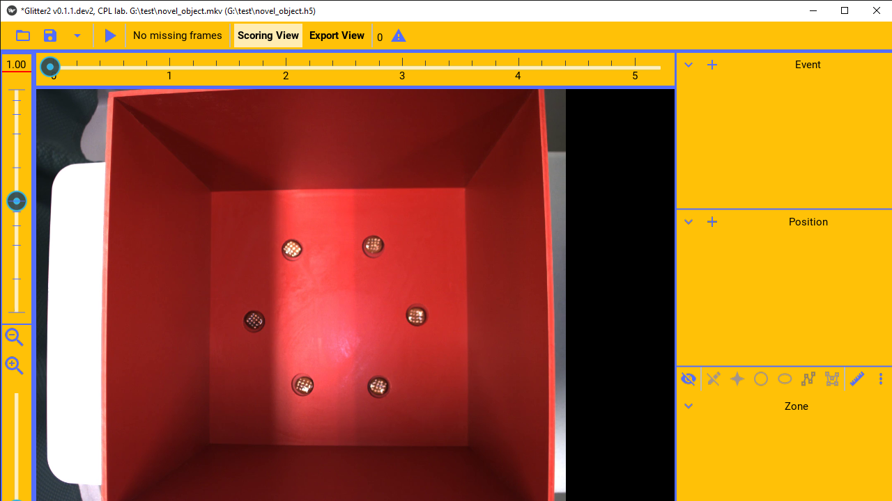
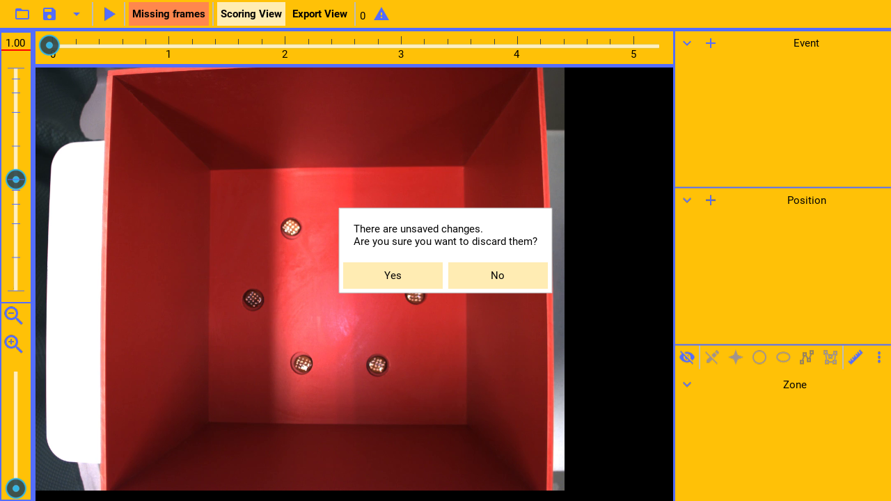
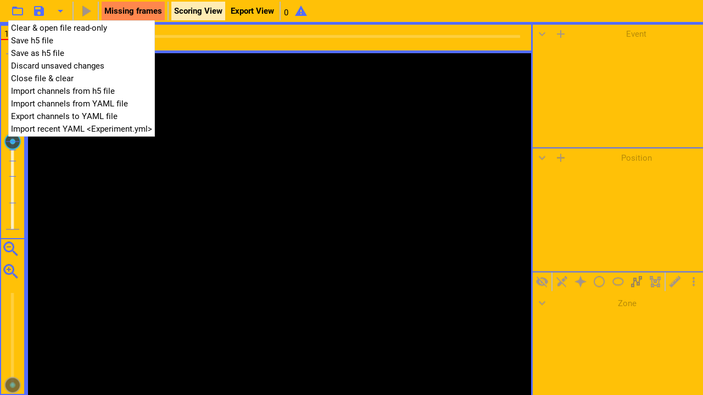

Glitter lets you code behaviors, and lets you track the position of objects in a video file.

---

(narration-mode: fragment)


To begin, browse for a video file with the browse button.

(callout:
  type: rectangle
  left: 10
  bottom: 35
  right: 50
  top: 0)

---



and select a video file.

---



This will open the video file in glitter.

---

```
Data file
```

(pause: 3)


---



(callout:
  type: rectangle
  left: 220
  bottom: 240
  right: 455
  top: 95)

When data is coded with glitter, it stores the coded data, in a h 5 file right next to the video file.

---


(callout:
  type: rectangle
  left: 220
  bottom: 240
  right: 345
  top: 95)

If the data file already exists, glitter will open the data file. Otherwise it will create a new data file.

This data file is later used when computing and exporting statistics.

---


(callout:
  type: rectangle
  left: 455
  bottom: 240
  right: 570
  top: 95)

Glitter also creates a temporary file, in which the data is saved periodically, in
case of a program crash before the data is explicitly saved.

---



(callout:
  type: rectangle
  left: 0
  bottom: 30
  right: 475
  top: 0)

Once a file is opened, the full path to the video and data file currently open is shown in the title bar.

---

```
Saving
```

(pause: 3)


---

(narration-mode: fragment)


To save all unsaved data, to the h 5 file

---


(callout:
  type: rectangle
  left: 50
  bottom: 35
  right: 95
  top: 5)

press the save button

---


or, hit the control s keyboard key.

---


(callout:
  type: rectangle
  left: 25
  bottom: 30
  right: 50
  top: 0)

To check whether data is unsaved.
The presence of an asterisk in the title bar indicates that some of the data is currently unsaved.

---



(callout:
  type: rectangle
  left: 480
  bottom: 425
  right: 800
  top: 290)

Additionally, a prompt is shown before closing, if data is unsaved.

---

```
Advanced data controls
```

(pause: 3)


---


(callout:
  type: rectangle
  left: 85
  bottom: 35
  right: 125
  top: 0)

Glitter supports additional data operations through the drop-down menu.

---

(narration-mode: fragment)



(callout:
  type: rectangle
  left: 15
  bottom: 84
  right: 280
  top: 61)

It supports saving normally,

---


(callout:
  type: rectangle
  left: 15
  bottom: 107
  right: 280
  top: 84)

as well as saving any changes to a new h 5 file, leaving the currently open data file unchanged. 

---


(callout:
  type: rectangle
  left: 15
  bottom: 61
  right: 280
  top: 38)

It can open a video and data file in read only mode. Such that no changes can be saved to that file.

---

(narration-mode: fragment)


(callout:
  type: rectangle
  left: 15
  bottom: 130
  right: 280
  top: 107)

It can remove any unsaved changes and reset to the last saved state

---


(callout:
  type: rectangle
  left: 15
  bottom: 153
  right: 280
  top: 130)

or close the currently open file altogether.

---


(callout:
  type: rectangle
  left: 15
  bottom: 176
  right: 280
  top: 153)

It can import all the channels metadata from an existing data file, without also importing the coded channel data.

---


(callout:
  type: rectangle
  left: 15
  bottom: 222
  right: 280
  top: 199)

To facilitate sharing a template with all the channels, without the channel data.

The channels metadata can be exported to a special yaml file and shared with others.

---


(callout:
  type: rectangle
  left: 15
  bottom: 199
  right: 280
  top: 176)

Others can then import these channels from the yaml file.

---


(callout:
  type: rectangle
  left: 15
  bottom: 245
  right: 280
  top: 222)

As a convenience, the most recent yaml template imported is listed in the menu.
And it can be imported again without having to browse for it.

---
