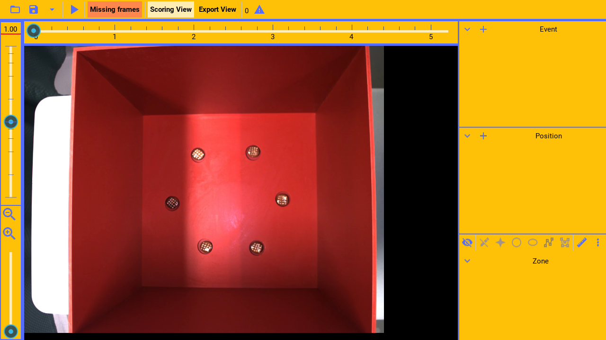
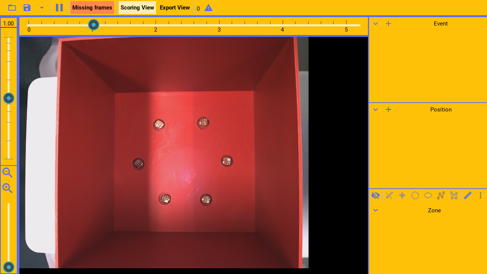
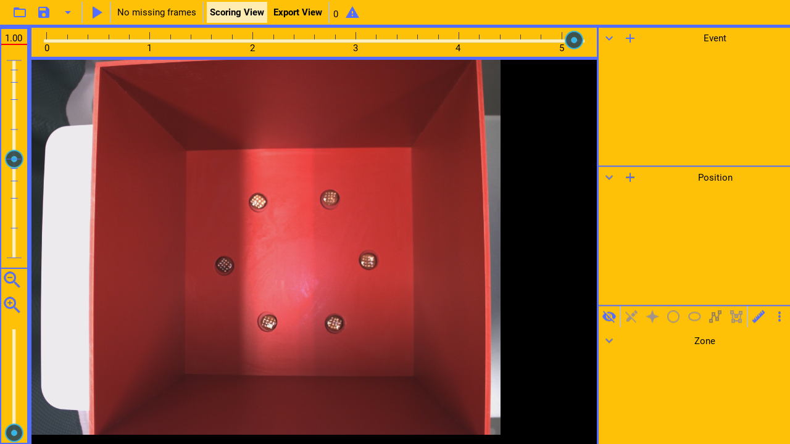
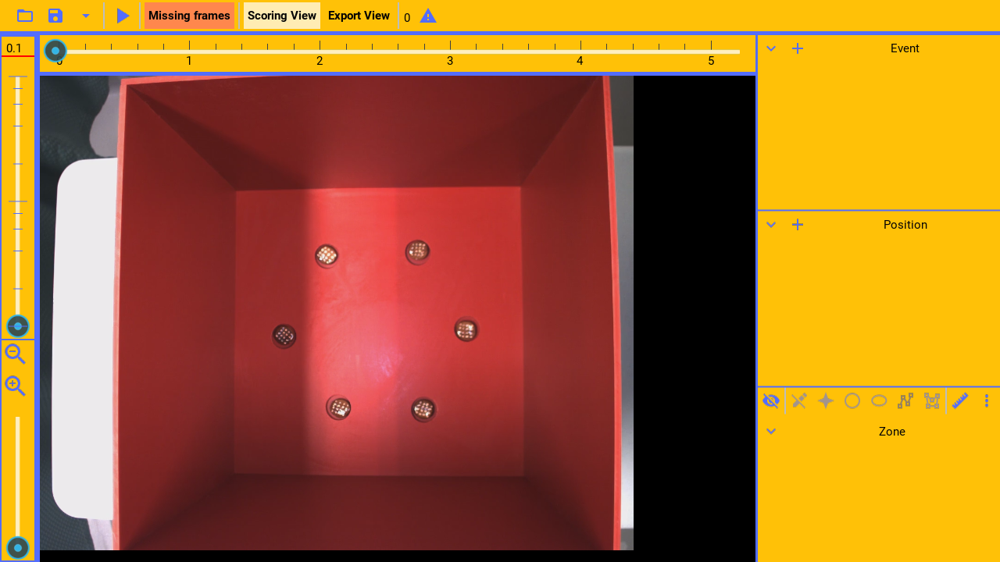

Once a video file is open, you can play or control the player, using the mouse or the keyboard.

---

```
Playing / pausing
```

(pause: 3)


---


(callout:
  type: rectangle
  left: 135
  bottom: 35
  right: 175
  top: 5)

To play the currently open video, press the play button.

---



(callout:
  type: rectangle
  left: 135
  bottom: 35
  right: 175
  top: 5)

Or press again, to toggle between paused and playing.

---


The space-bar key can also be used to toggle between playing and paused.

---

```
Missing frames
```

(pause: 3)


---


(callout:
  type: rectangle
  left: 180
  bottom: 40
  right: 305
  top: 0)

If the player didn't play all video frames, for example if some frames have been skipped, 
the indicator will show this. To be able to export the data correctly, all frames must
have been played.

---



(callout:
  type: rectangle
  left: 180
  bottom: 40
  right: 325
  top: 0)

Once all frames have played, the indicator shows that no frames are missing and that
the data can be safely exported.

---

```
Play rate
```

(pause: 3)


---

(narration-mode: fragment)


(callout:
  type: rectangle
  left: 0
  bottom: 435
  right: 42
  top: 45)

Drag the slider to change the video playing speed

---


(callout:
  type: rectangle
  left: 0
  bottom: 80
  right: 42
  top: 45)

or write the exact speed in frames per second.

---


Alternatively, use the up and down keyboard arrows to control the speed without having to use the mouse.

---

(video:
  file: play_rate.mp4
  sync: loop)

(pause: 2)

Notice that the slider is logarithmic over its range.

---



When the lowest speed is selected, the player will enter frame by frame mode. In frame by frame mode, to
move to the next video frame, press the right arrow on the keyboard. This allows more accurate coding.

---

```
Seeking
```

(pause: 3)


---


(callout:
  type: rectangle
  left: 50
  bottom: 92
  right: 968
  top: 42)

Drag the slider in the seek bar, to seek in the video to the closest seek point.
The right and left arrow keys can also be used to seek.

In frame by frame mode, the right arrow key is used to advance the video by one frame.

---

```
Zooming
```

(pause: 3)


---


(callout:
  type: rectangle
  left: 0
  bottom: 718
  right: 44
  top: 435)

Zoom the video with the zoom slider and zoom or zoom out buttons.

---


---
