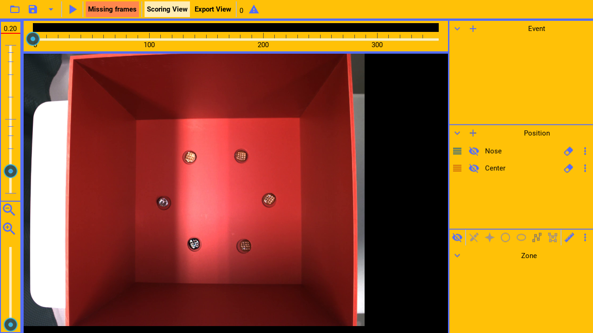
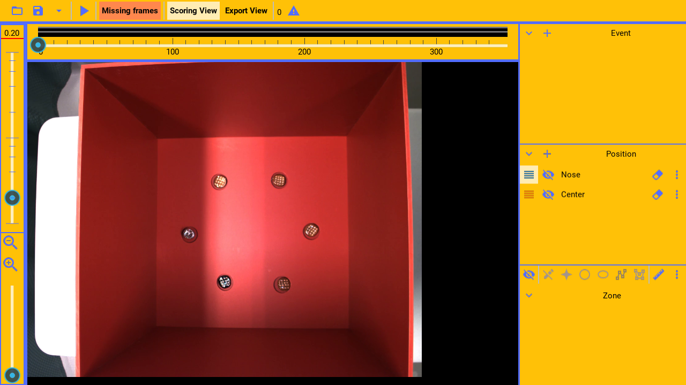
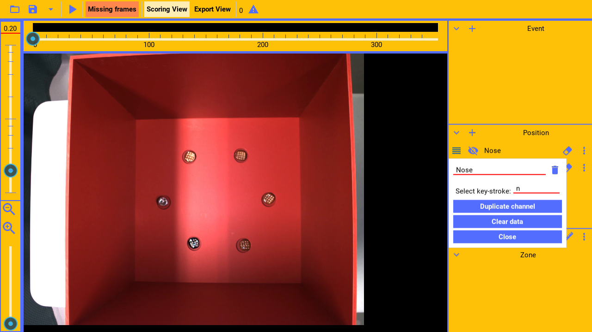
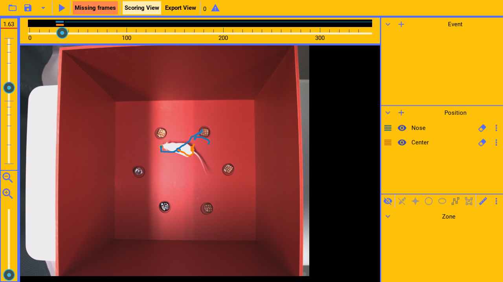
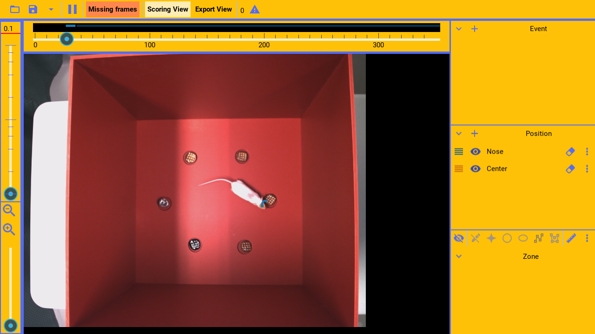

(video:
  file: draw_pos.mp4
  sync: trim)

(pause: 2)

Position channels code the position of objects across video frames. For example, it could code the center
or nose of the animal.

The coded data can later be exported as raw data or summarized. For example, it can export
the mean speed of the animal, or the mean distance to a point.

---

```
Managing channels
```

(pause: 3)



---


Much of the channel management for position channels, is the same as for event channels.
Please see the event channel guide.

---

```
Coding position
```

(pause: 3)


---


To code a channel, first select the channel.

(callout:
  type: rectangle
  left: 965
  bottom: 340
  right: 1005
  top: 305)

---



Now the channel can be coded with the mouse.

---



A position channel can also be selected with an assigned keyboard key, such as n in this example.

---

(video:
  file: draw_pos.mp4
  segment: 00:00 - 00:15)

Once selected, while the video is playing, follow the position of the nose with the mouse pressed down. This
will code the nose position for the current video frames.

---


Select the center channel to then code the position of the mouse center.

---



The recent position history of the tracked object can be shown, if enabled.

(callout:
  type: rectangle
  left: 1000
  bottom: 385
  right: 1040
  top: 305)

---


Press the history button to show or hide the position history.

---


(pause: 2)

---

```
Frame by frame
```

(pause: 3)


---


Normally, the player will continuously show new frames to code.

(callout:
  type: rectangle
  left: 0
  bottom: 435
  right: 45
  top: 45)

---

(narration-mode: fragment)



However, by setting the frame rate to the minimum,

(callout:
  type: rectangle
  left: 0
  bottom: 435
  right: 45
  top: 45)

---


the player shows a single frame, and only advances to the next frame, when the mouse is pressed to code the frame.

This allows more accurate coding.

---
