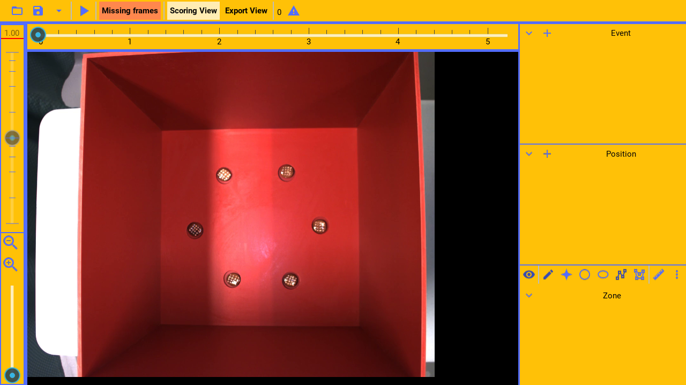
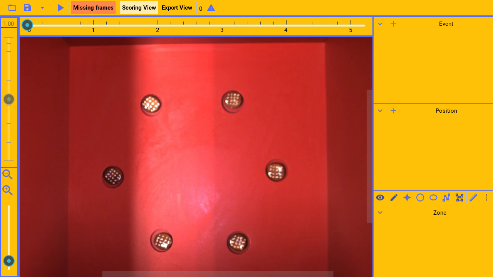
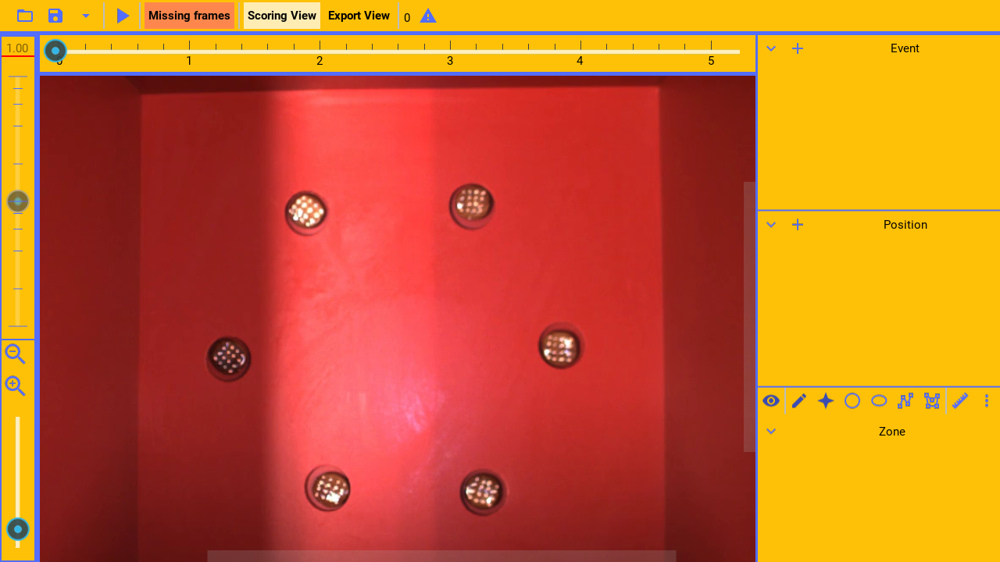

(video:
  file: draw_free.mp4
  sync: loop)

(pause: 2)

Zone channels code the position of static objects in the video. For example, it could code the position of
odors to be sniffed.

The coded data can later be exported as raw data or summarized. For example, it can export
the area of the zone, or the duration the animal was in the zone, if coded.

---

```
Managing channels
```

(pause: 3)


---


Much of the channel management for zone channels, is the same as for event channels.
Please see the event channel guide.

However, unlike event channels, zone channels are added by drawing them.

---

```
Drawing zones
```

(pause: 3)


---

(narration-mode: fragment)


To draw a zone, first enable showing the zones,

(callout:
  type: rectangle
  left: 970
  bottom: 525
  right: 1005
  top: 495)

---


then, enable editing the zones.

(callout:
  type: rectangle
  left: 1005
  bottom: 530
  right: 1045
  top: 500)

---



The type of zone created, is controlled by the zone mode selected. The default is freeform.

(callout:
  type: rectangle
  left: 1040
  bottom: 530
  right: 1210
  top: 500)

---

(narration-mode: fragment)


To draw a freeform polygon,

(callout:
  type: rectangle
  left: 1140
  bottom: 530
  right: 1175
  top: 500)

---

(video:
  file: draw_free.mp4
  sync: loop)

drag the mouse over the area to enclose.

---

(narration-mode: fragment)



To draw a more precise polygon,

(callout:
  type: rectangle
  left: 1175
  bottom: 530
  right: 1210
  top: 500)

---

(video:
  file: draw_poly.mp4
  sync: loop)

place polygon vertices by pressing the mouse on each point. To finish, double click the mouse.

The zone can be edited by slow-pressing a vertex and dragging it. The overall zone can be dragged,
when not editing it, by dragging the first point.

---

(narration-mode: fragment)


To draw an ellipse,

(callout:
  type: rectangle
  left: 1110
  bottom: 530
  right: 1145
  top: 500)

---

(video:
  file: draw_ellipse.mp4
  sync: loop)

drop the ellipse center with the mouse. Then, edit it, by dragging the points on the radius.

---

(narration-mode: fragment)


To draw a circle,

(callout:
  type: rectangle
  left: 1075
  bottom: 530
  right: 1110
  top: 500)

---

(video:
  file: draw_circle.mp4
  sync: loop)

drop the circle center with the mouse. Then, edit it, by dragging the point on the radius.

---

(narration-mode: fragment)



To place a single point,

(callout:
  type: rectangle
  left: 1040
  bottom: 530
  right: 1075
  top: 500)

---

(video:
  file: draw_point.mp4
  sync: loop)

drop the point with the mouse. It can be edited, by dragging the point.

---


The zones can be hidden or shown, by toggling the display button.

(callout:
  type: rectangle
  left: 970
  bottom: 525
  right: 1005
  top: 495)

---


To either show them.

---


Or hide them.

---
